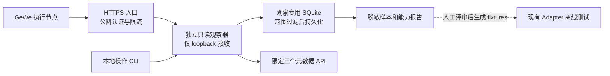

# GeWe A2a 只读观察器构建方案

日期：2026-09-16。状态：设计交付，未实施代码、注册、部署或启动实机。承接 [v0.5 spec](personal-wechat-agent-poc-v0.5.md)、[后端适配报告](../poc/evidence/adapter-prep-2026-09-16.md)和[现有准备清单](../poc/evidence/a2a-gewe-prep-prompt-2026-09-16.md)。

## 1. 结论与完成目标

先构建独立、无发送能力的 GeWe 只读观察器，完成入口认证、持久接收、协议样本核对及 30 分钟内的停机闭环。暂不把回调接入 `ApiRuntime.tick()`，也不解锁 A3/A4。

本方案在 A2a 内区分“连接与采样”和“触发协议验收”。采样允许 `mention_status/history_status=unknown`，输出仅供核验；自动回复仍要求真实 @、新消息、成员身份及来源认证均满足 v0.5。这样无需先证明未知字段才允许采样，也不会为采样而放松发送守卫。

这是一项方案修订：现有准备清单中“反代统一添加桥接令牌”不再被当作供应商来源证明。旧 A2a 提示词须结合本方案使用。更高版本主 spec 尚未改写，实施时应把本方案的观察分层显式纳入配置和测试，不能偷偷删除全局 blockers。

完成判据分开报告：

1. 本地实现：无网测试及本地 HTTP 集成通过，发消息 API 和模型调用为 0。
2. 只读连通：经后续明确启动后，指定测试账号/混合群的回调可持久接收、状态可查、可停止。
3. 协议验收：身份、真实 @、历史/同步和时间语义有样本证据；不齐全则保持部分通过。
4. 自动回复准入：另行判断，不由前两项自动升级。

## 2. 已核对的缺口

基线 `157eecf`＋用户现有未提交 A1/GeWe 适配；本次只读查看，没有重新执行报告中的 163 项测试。

| 位置 | 当前行为 | 构建要求 |
|---|---|---|
| `gewe_channel.authenticate_callback` | 比较 `X-Wechat-Bridge-Token` | 区分公网请求认证和内部桥接认证 |
| `gewe_channel.normalize` | 推测 fromUser/toUser 方向，有 sender 就 resolved | 依据固定版本和受控样本验证成员身份，不能根据非空值判通过 |
| `gewe_channel.normalize/probe` | `session_epoch=appId` | appId 作为设备键；运行世代另行生成并与在线身份观测绑定 |
| `mention_status/history_status` | 固定 unknown | 保留，观察阶段采样；有证据后单独实现解析规则 |
| `live_arm_blockers` | 把 @/历史缺口同时用于所有 live profile | 拆分只读观察条件和自动回复条件，不能全局移除缺口 |
| `ApiRuntime.start` | 拒绝所有真实 start | 不用它启动只读观察器，保留当前自动运行停点 |
| `api-observe` | 无条件返回未执行 | 增加独立 ObserveSession 生命周期 |
| `api-check --probe` | GeWe 真 HTTP 被拒绝 | 实现后仍需显式只读启动范围；普通 check/status 不联网 |
| `ApiRuntime.ingest_callback` | 接收事件进入 Agent inbox | 观察样本使用独立库，永不被 Agent worker 消费 |

## 3. 推荐架构与取舍

| 设计 | 接口与职责 | 代价/限制 | 结论 |
|---|---|---|---|
| 在现有 Agent runner 中增 observe 分支 | `runtime.start(profile=observe)`，共用 inbox/任务/模型初始化 | 改动表面较少，但只读生命周期与可发送运行器耦合，历史样本容易进入后续 worker | 不采用 |
| 公网入口入队，本机拉取 | `ingress.accept`＋`agent.pull(cursor)`，中间持久队列 | 可跨网络，新增队列、双端 ACK、游标和部署状态 | 首轮无需这份复杂度 |
| 同机 TLS 入口＋独立观察器 | `observer.start/accept/status/stop`，SQLite 样本库 | 与 Agent 隔离，后续需显式导出脱敏 fixture | **采用** |

正式拓扑建议将 TLS 入口、观察器和样本 SQLite 放在同一台已选定的受控主机，避免回调应答链路跨机器。开发时只监听 `127.0.0.1`，使用合成数据；不预先假定用户已有云主机、域名或可用公网端口。本方案未选定或采购主机。



公网只公开回调路由；状态、导出、停止只走本机 CLI。A2a 进程不加载 AgentPolicy/M3、不构造发送工具、不创建 outbox 和任务。即使用户误配 `allow_live_send=true`，也应在启动前报错。

技术选择：Python HTTP 接收层建议使用 Starlette＋Uvicorn 单 worker，作为独立可选依赖组；业务逻辑和 SQLite 保持现有 Python 风格。实施时通过项目包管理器解析并锁定版本，再验证 Windows 环境；本方案没有安装依赖或宣称兼容性已验收。SQLite 操作放受控单写线程，不能在异步事件循环内等待长事务；无需 Redis、Celery 或额外消息总线。

## 4. 两段认证，不能混为一谈

### 4.1 公网：验证 GeWe 或回调凭据持有者

当前查到的 GeWe Webhook 文档描述公网 POST、3 秒应答和回调验证请求，未给出足以实现供应商签名校验的完整协议。**未写明不等于断言供应商绝对不支持。** 部署前询证以下能力，不能编造供应商会发送的签名头。[Webhook 文档](https://doc.geweapi.com/doc-3146208)

| 模式 | 实现条件 | 可证明的内容 | 本方案允许范围 |
|---|---|---|---|
| `vendor_signature` | 供应商给出签名字段、算法、原始字节串规则、时间/重放规则及密钥交付方式 | 经核验的供应商签名及防重放 | 验收后可用于自动回复来源门槛 |
| `vendor_mtls_or_private` | 供应商实际支持专属客户端证书或已认证私有链路，证明绑定到指定租户/节点 | 已认证来源通道 | 同上，不能仅凭“在内网”成立 |
| `callback_bearer` | 供应商可保留随机路径，或支持配置自定义认证 header；经过受控回调验证 | 请求者持有 callback secret；**不证明供应商身份** | 仅后续明确启动的有界只读采样，不能据此开放 A3/A4 |
| `none` | 无上述认证 | 无可信来源 | 仅离线合成测试，禁止公网实机采样 |

推荐先实现 `callback_bearer` 的离线与只读采样能力，并保留来源等级；同时向供应商确认更强认证。不能为了尽快自动回复，把 bearer_only 标成 vendor_verified。若供应商最终无法提供满足自动回复准入的来源证明，应记录后端不满足当前契约，而不是无限加桥接层。

路径方案示例仅为形态：`POST /callbacks/gewe/<random-secret>`。secret 由操作人在本地生成至少 32 随机字节，只配置到 GeWe 的回调 URL，不出现在 Git、聊天或示例默认值。自定义 header 支持未知，不以它为唯一启动前提。验证回调地址不代表验证了消息来源。

要求：TLS 全程；关闭该路由 URL/正文访问日志和错误页回显；禁止把秘密放 URL 查询参数；控制台、反代、应用和隧道的日志都检查脱敏；可撤销和轮换。路径 secret 泄露即停止并更换。若供应商提供固定出口，附加经核实的出口 allowlist；IP 只作辅助限制，不把伪造的 `X-Forwarded-For` 或随便一次观察到的 IP 当信任依据。不要向全互联网暴露无认证的“调试回调”。

### 4.2 内部：验证来自受控入口

公网入口先完成配置的来源策略，然后：

1. 删除外部请求携带的全部 `X-Wechat-Bridge-*`/来源等级头，不能允许重复头或大小写变体绕过。
2. 拒绝失败请求；仅成功者注入内部 bridge token 和入口验证结果。
3. 观察器只监听同机 loopback，校验 bridge token，来源等级从可信入口元数据或本地固定配置读取，不接受 body 声称已签名。
4. 两种凭据分开：callback secret、内部 bridge token；与 `X-GEWE-TOKEN` API 凭据也不共用。使用常量时间比较。API 凭据不交给公网 TLS 入口。

当前 `GeweChannel.authenticate_callback` 可继续表示“内部桥接认证”，但必须更名或明确注释语义。它不能单独返回 `vendor_verified`。未来跨主机桥接另行设计 mTLS 或带重放保护的内部签名，本轮不预先实现。

## 5. 只读观察生命周期与权限

新增 `GeweObserver`，最小公共接口：

```text
start(scope, readonly_client, ingress_policy, store) -> observe_run_id
accept(verified_ingress, raw_bytes) -> Ack
status() -> ObserveStatus
stop(reason) -> StopResult
```

状态：`prepared → probing → awaiting_binding → observing → stopping → stopped`；异常可进入 `paused/failed`。默认期限 1800 秒，最大正文样本数 200，累计样本正文上限 10 MiB；到限即停止接收正文。这些是本轮设计默认值，可调小。

`ReadOnlyGeweClient` 只开放已查证的三个 POST 路径：`checkOnline`、`getProfile`、`getChatroomMemberDetail`。底层 transport 也校验主机、HTTPS 和精确路径白名单，禁止重定向、任意 URL 及 `postText`。构造对象不能触发请求。不要仅依靠“观察器不会主动调用 submit”来隔离写能力。

生产根地址必须确认支持 HTTPS；profile 中文档示例 `http://api.geweapi.com` 不能直接拿来传 token。如果只有明文公网地址，保持阻断，不能关证书校验或临时明文试一次。

顺序：

1. 本地校验配置、期限、认证策略、独立样本路径及发送/模型关闭；不存在运行许可时不接受回调正文。
2. 显式 A2a 启动后，用只读白名单接口核账号与在线状态。请求在 SQLite 事务外执行，避免网络延迟锁库。
3. 已知候选群/成员键可来自现有本地配置或控制台，始终只是线索；用指定群元数据和参与者核验确认。缺群键时先核查厂商是否提供限定查询/控制台获取方式，不能默默改用全量通讯录。
4. 账号与指定候选群有足够范围证据后才开始该群正文采样；缺乏可靠路由时保持 awaiting_binding，不存全账号原始消息等待“以后再过滤”。
5. 生成新的本地 `observe_epoch`，绑定真实账号、appId、绑定版本和启动时间。appId 只是设备标识，不假设它会随重登录改变。
6. 元数据探针串行运行，默认每 15 秒一次在线检查、每 60 秒一次本人核对；每次最多 8 秒，不自动重试失败请求。失败暂停采样，重连需新 run 和新基线。未知下线系统事件可促使一次只读重核，不因不可信文字直接改变账号权限。
7. `stop` 原子撤销观察许可；所有请求在持久化前重查许可和 epoch，取消未提交样本，关闭监听；状态读回只读。进程重启不自动恢复监听或采样。

`observe_blockers` 检查显式只读授权、账号/群范围、入口认证等级、真实凭据引用存在、部署条件和存储可写；不要求已知 @与历史规则。`agent_blockers` 继续要求 v0.5 所有发送和触发条件。不要直接复用当前 `ApiRuntime.start()` 的 fake 专用路径，也不要改掉 A3/A4 的 live 拒绝。

## 6. 回调持久化与快速应答

HTTP 接收层默认只处理 POST、JSON（按厂商实际 charset 验证）、完整 body 不超过 256 KiB；流式计数，不只相信 Content-Length；拒绝压缩编码，防止解压放大。原始字节传到签名层前不能重序列化。速率上限默认每观察 run 10 请求/秒、突发 20，超限统计并评估样本缺失，不能记零丢失。

处理顺序：入口认证 → 请求大小/JSON检查 → 账号/appId/群范围过滤 → SQLite事务持久化 → 提交成功 → 应答。期间不调用厂商元数据 API、模型或 Agent worker。元数据缓存不足则存受限“待核验”样本，不同步查网。

独立 `poc/.local/gewe-observe/observe.sqlite`，专用 `PRAGMA user_version=1`，不改 Agent 状态库。SQLite 使用本地磁盘、WAL 和 `synchronous=FULL`，写入队列受限，事务等待预算应保证端到端通常小于 1 秒；请求整体应答目标小于 2 秒，不超过供应商 3 秒要求。超时任务取消前核对是否已提交，避免队列里长期悬挂；提交已发生但响应失败可由去重应对重复，不能承诺厂商一定重投。[应答要求](https://doc.geweapi.com/doc-3146208)

| 情况 | 应答与记录 |
|---|---|
| 合法目标群事件，持久化完成 | 200，仅固定短响应，不返回正文/内部ID |
| 同一消息重复且内容一致 | 200，增加投递次数，不新增样本或业务事件 |
| 非绑定群或私聊 | 200丢弃，正文不落库，仅匿名计数 |
| 已认证的控制台连通探针 | 独立握手类型，200并记录计数；不作为微信事件或来源通过证据 |
| 未认证/错误秘密 | 401/403，不存正文 |
| 超大/格式错误 | 413/400，不存正文，仅原因计数 |
| 库不可写/锁超时/队列满 | 503，记录缺口并暂停；不返回伪持久化成功 |
| unknown类型但能可靠确认是指定群 | 受限诊断样本，200；不能交给Agent |
| 无法确定账号/群 | 丢弃正文，200＋匿名结构错误计数；不扩大采样范围 |

表建议：`observe_runs`、`samples`、`counters`、`bindings`、`capability_evidence`。样本键优先 provider＋账号＋群＋原生消息ID；缺原生ID的诊断样本只以 body hash 在单 run 去重，不当作可回复事件。同ID不同body保留有限冲突记录并暂停，不覆盖旧证据。

样本存到已限制访问的本地目录：保留厂商事件所需字段与指定测试正文；默认剔除电话、头像URL和无关个人资料。仅目标群受控样本可保留受限原始 JSON 用于解析核验，不写日志、不上传模型、不提交 Git。7天到期列清理项，不创建自动删除任务；脱敏fixture使用稳定替代ID保留字段结构和必要原生整数精度。

## 7. 未知字段如何验证，不能如何猜测

### 7.1 成员身份与群路由

当前 normalize 对 `fromUser` 为群时将 `toUser` 当发送成员，并以非空判 resolved；本轮必须用两类成员分别发的受控样本核验实际语义。`@openim` 可能出现在身份键中，不能只凭后缀认定它是群。验证群键来自元数据与指定群样本对照，验证成员键来自限定群成员查询。

把“字段解析成功”和“成员属于绑定群”分成两项证据；identity 只有后者成立才 resolved。本人消息需要本人键与来源字段一致，不能仅相信回调的布尔标志。

### 7.2 真 @识别

依次采集：仅@本人、@其他人、文字输入的假@、引用中@、多对象@、普通文字；企微成员和个微成员分开记录。@所有人无权限则未执行。只允许从供应商实际提供的结构化字段/XML元数据提取成员列表；XML禁用DTD/外部实体。

样本没有结构化@时，保持 unknown。不能通过正文匹配、LLM判断或“被提问就是@”替代。若厂商始终不提供，A3 在当前触发契约下不可启动，需要更换后端或另行明确修改产品触发要求。

### 7.3 历史、新鲜度和连接世代

公开文档描述重启、历史同步和失败重试都可能造成重复，因此“刚收到回调”不能证明消息新鲜。[回调v2说明](https://doc.geweapi.com/doc-8680561)

测试应由参与者手工在指定群发送含随机测试编号的新消息，记录发送时间，并与重连/旧消息样本比较。操作者标签只是 ground truth；除非得到可靠字段和协议规则，不能据此把后续所有事件 `history_status` 设为 false。

评估的证据包括可信来源时间、是否有明确同步标志/游标、启动基线、重连行为、完整去重和时钟偏差。仅使用 `createTime >= armed_at` 属于候选规则，必须确认时间语义及历史样本反例后才可提议成为契约；本轮不自动改变 v0.5 的 unknown 阻断。无法可靠判别时观察可继续，自动回复不可启用。

每个运行使用本地epoch；断线/账号变化/重新登录都使旧epoch失效，静默会话替换若无法检测，应列覆盖限制。不要承诺当前 appId 能解决此问题。

### 7.4 消息ID精度

Python JSON 使用整数无损解析后转字符串；拒绝 float/指数形式的ID，保留诊断原因。桥接/反代按字节转发，不经 JavaScript Number 反序列化。用超过 `2^53` 的合成ID和真实样本交叉验证；若源服务生成JSON前已丢精度，本地转字符串无法修复，须供应商提供字符串ID或可靠原始标识。

## 8. 代码落点与迁移边界

| 文件 | 计划改动 |
|---|---|
| 新 `gewe_observer.py` | HTTP应用、观察生命周期、只读client和认证策略的组合入口；复杂度需要时再拆，不一接口一文件 |
| 新 `gewe_observe_store.py` | 专用样本库、原子许可/去重、容量/保留元数据 |
| `gewe_channel.py` | 保留发送停点；更明确的来源/身份/epoch语义；只读请求白名单可复用，不自动运行 |
| `api_config.py` | 分级 blockers、观察配置、未知字段拒绝、有效env值检查；`allow_live_send=false`强制 |
| `api_cli.py` | 真正实现只读 `api-observe`，status/stop/导出支持明确选择 observer；普通查询不构造网络对象 |
| 新观察配置示例 | `observer-config/1` 或显式独立观察段，默认 disabled/loopback，所有secret为空引用 |
| `pyproject.toml` / `uv.lock` | 只在实施时新增锁定的可选HTTP依赖；不改变既有必装依赖 |
| 原准备清单 | 实施后修正“统一加头即认证”及尚不存在的执行命令 |

为避免修改共享配置格式，推荐新增独立 `observer-config/1` 文件，`api-observe --observer-config <path>` 显式加载；旧 `api-config/1` 保持行为。现有 status/stop 默认仍指向 Agent，只有显式 observer 参数操作观察许可，不能猜最近一个run。CLI解析先识别观察入口，再加载对应配置，避免旧配置必填项造成采样死锁。

部署默认单 worker、单观察会话；多进程/多账号先拒绝启动。不得把 observer.sqlite 指向 api-agent/state.sqlite 或旧 PoC 状态库，路径重合校验须有反例。

## 9. 分步构建与验收

### G1：纯本地构建

实现只读观察器、入口认证策略、专用Store、CLI及限定元数据客户端。供应商签名模式在没有真实协议时保持 unsupported，不能用自造签名格式通过测试后宣称支持 GeWe。

关键测试：伪造内部头不能通过公网入口；callback secret与bridge secret不能互换；直接访问后端被拒；scope不符正文不落库；停机与入库竞态；unknown字段能观察但不能流入Agent；DB错误不200；重复/冲突；大body/慢请求/容量耗尽；精度；写API、模型、任务的spy计数始终为0；构造/status/stop零联网。

使用本地真实HTTP listener＋临时SQLite验证响应和持久化顺序，不能只依赖函数单测。先相关检查，再跑既有必要回归；真实服务、token、微信消息全不使用。

### G2：具体部署准备

列出待选主机、域名/TLS、费用、数据路径、认证模式及供应商待答问题。没有主机或凭据不妨碍G1。公网部署、注册/付费、回调URL配置和扫码只有后续明确启动时执行；不把本文视为已批准SaaS或公网暴露。

部署前验收：TLS正确、应用仅loopback、管理路由不公网、入口不能伪造内部认证、路径秘密不入日志、只读API根使用HTTPS。没有可工作的秘密回调或更强认证时保持离线；临时隧道不是认证替代品，且需评估端到端3秒期限。

### G3：有界 A2a 连接与采样

操作人完成所选节点登录后，明确启动30分钟只读观察。先一个受控事件验证管线，再执行企微/个微各10条独立消息和@反例矩阵。没有第二个个微时，本人手机消息只算接收/本人反例，不算非本人触发正例。重连样本需单独安排，不自动重启微信或切账号。

输出真实计数、丢失/重复/冲突、应答P95/最大值、身份映射、字段证据和来源等级；记录 `mention/history` 的 unknown 数量。停止后证明监听停止、许可已撤销、无模型/发送请求。连通成功但分类规则不齐全时，判“只读采样通过当前限定场景；触发协议验收未完成”。

### G4：协议规则收敛

根据受控样本编写精确版本parser与脱敏fixture并回归；能力状态逐项引用case_id升级，不批量把capabilities置true。无法补齐的来源、mention或新鲜度条件保留自动回复阻断，明确供应商需提供什么或后端需更换什么。

## 10. 可复制的下一步构建提示词

```text
请在 `D:\path\to\ZJ-AI-WXBot` 按 specs/gewe-a2a-observer-build-plan-2026-09-16.md 实施 G1，并准备 G2 的具体部署清单。

先读现有A1/GeWe适配报告、源码及未提交改动，保留已有工作。实现独立GeweObserver和观察专用SQLite，接入明确的observer配置/CLI，避免复用可发送的ApiRuntime.start/tick。观察进程不得初始化模型、发送工具或任务；下层transport只允许checkOnline/getProfile/getChatroomMemberDetail，HTTP真实根必须HTTPS。

公网认证与内部bridge认证分开：先验证供应商实际支持的来源机制或callback bearer，再去掉外部伪造头并注入内部bridge凭据。供应商签名协议未知时不得自造。callback bearer只证明凭据持有者，来源等级不得升级为vendor_verified，只支持后续有界只读采样。无认证只可离线测试。

实现范围过滤后持久化再应答、1秒处理目标、DB失败不200、容量/期限限制、去重/冲突、停止竞态、独立epoch和只读探针。mention/history未知仍可生成隔离的观察样本，但不能进入Agent inbox或触发业务。身份非空和appId均不能当作已验证身份/会话世代。

只使用合成数据、本地HTTP桩和临时SQLite完成验证；新增HTTP可选依赖时通过现有包管理器锁定并检查Windows兼容。测试伪造来源、直接后端访问、只读写路径拒绝、非目标正文零落库、unknown零业务、消息ID精度、停机和超时故障，确认真实微信/M3/发送请求均为0。完成相关检查和必要回归，更新现有A2a准备清单中的认证描述与实际命令。

交付实现、配置示例、测试记录，以及主机/HTTPS/认证/费用/数据路径/供应商问题的具体部署清单。没有外部条件也先完成G1；不要停在要求用户先提供token。不得注册、购买、配置公网、扫码、调用真实GeWe、开启G3/A2a、发送、创建定时任务或commit/push。
```

## 11. 本轮来源与证据边界

- [GeWe Webhook](https://doc.geweapi.com/doc-3146208)：本轮重新读取，公网POST、3秒应答、API发送不回显；未取得完整签名协议。
- [GeWe 回调v2](https://doc.geweapi.com/doc-8680561)：本轮重新读取，appid设备标识、消息字段及重复投递原因；没有证明当前混合群语义。
- 本地 `gewe_channel.py`、`api_runtime.py`、`api_config.py`、`api_cli.py`、profile和准备清单：本轮只读核对。
- HTTP框架选择是工程建议；本轮官方框架页面抓取失败，未核实最新版本，版本选择与兼容性验证放到G1执行，不据此声明生产可用。

本文只新增方案文档，保留现有未提交实现；旧163 passed不作为本轮新增检查结果。
