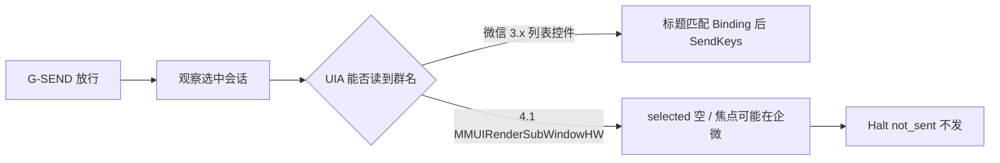
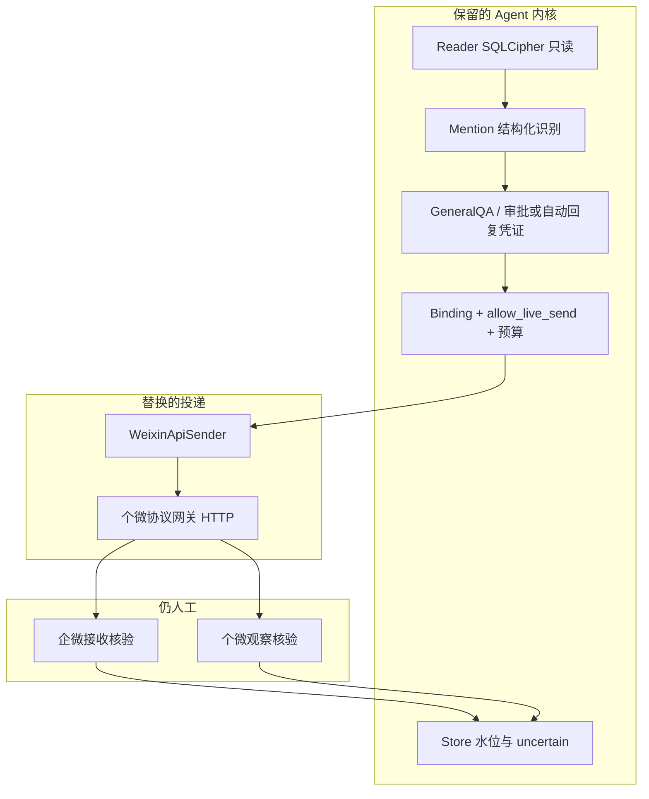

# 个微 Agent 技术实现方案：现状与 API 发送接管

> 2026-09-16 路线更新：后续实现以 [spec v0.5](personal-wechat-agent-poc-v0.5.md)及[操作提示词 v0.5](personal-wechat-agent-implementation-prompt-v0.5.md)为准。UIA 暂停，API 改为同时接管收发，支持有界主动对话；本文保留作历史快照，“只换 Sender”不再是当前方案。

日期：2026-09-15。读者：后续实施与评审。状态：基于本机 PoC 代码与实机证据的技术方案，**未接入真实个微发送 API，未 commit/push**。

配套： [spec v0.4](personal-wechat-agent-poc-v0.4.md)、[官方接口边界](../evidence/official-boundary.md)、[T0–T2 证据](../poc/evidence/t0-t2-2026-09-15.md)、[T3 证据](../poc/evidence/t3-m3-2026-09-15.md)、[T4 ACK1 停点](../poc/evidence/t4-ack1-2026-09-15.md)。

## 1. 执行摘要

1. **现状已形成可替换的 Agent 内核**：绑定、只读采集、结构化 @识别、模型问答、发送守卫与原子预算已经在 `poc/wechat_agent_poc` 落地；缺的是一条能稳定打到原群的发送通道。
2. **桌面 UIA 发送在微信 4.1.13.65 上不可用。** 顶层窗口只有「微信」，会话区是 `MMUIRenderSubWindowHW` 自绘层，读不到选中群名。T4 ACK1 按 fail-closed **未执行**，不能靠 SendKeys 猜当前会话。
3. **后续发送改为个微 API 接管，不再把桌面键鼠当作主通道。** Agent 继续决定「能否发、发给谁、发什么」；协议/网关只执行「向已绑定 `conversation_key` 提交一条文本（及原生 @）」
4. **腾讯没有官方「个人微信开放平台发群消息」接口。** 本文的「个微 API」指测试号经操作人授权后，接入**自建或指定的个微协议网关 HTTP 接口**（社区常见形态：扫码登录 + `POST /message/postText` + 消息回调）。这不是公众号、小程序、企微智能机器人或会话存档。
5. **第一阶段只换 Sender，不推翻 Reader。** 继续用本机 SQLCipher 只读库做触发识别；发送走 API。读、发、模型三套凭据分离。双端接收核验、原子预算、错群即停仍然有效。

## 2. 调研范围与证据

### 2.1 已检查

| 类别 | 位置 | 结论用途 |
|---|---|---|
| 阶段契约 | `specs/personal-wechat-agent-poc-v0.4.md` | T0–T6 门槛、禁止项 |
| 配置与守卫 | `poc/wechat_agent_poc/config.py` `gates.py` `live_guard.py` | 顶层 `allow_*`、mode 锁、G-SEND |
| 读取 | `wal_view.py` `t1_pipeline.py` `locator.py` `chat_room_codec.py` | WAL、绑定、成员键 |
| @识别 | `mention.py` | 结构化字段，禁止昵称匹配 |
| 模型 | `general_qa.py` `responder.py` | T3 独立；runner 尚未接 general_qa |
| 发送 | `sender.py` `t4_pipeline.py` `wechat_ui.py` `weixin_uia.ps1` | Protocol 已存在；UIA 实机失败 |
| 运行态 | gitignored `live.toml` / `live-t4.toml`；T1/T4 证据 | 绑定群、ACK 未发出 |
| 官方边界 | `evidence/official-boundary.md` | 企微官方能力不等于个微托管 |
| 公开网关形态 | Gewechat 等社区 REST 封装（2026-09-15 检索） | 仅作接口形态参考，本仓库未部署、未联调 |

### 2.2 已验证事实 / 合理推断 / 未验证

| 标记 | 内容 |
|---|---|
| 已验证 | 测试号目录与本人键已本地绑定；目标群 `conversation_key` 唯一；T1 能读到该群新消息；真 @ 在 `source` XML `atuserlist`；T3 三次 M3 调用成立；微信 4.1 UIA 无会话名 |
| 合理推断 | 同一测试号在协议侧登录后，按群内部键 `…@chatroom` 发文本，PC 端同步后可被现有 Reader 看到为本人消息 |
| 未验证 | 选定网关与 4.1.13.65 / 混合外部群 / `@openim` 企微成员的兼容；协议登录是否挤掉 PC；API 原生 @ 是否被企微侧识别；端到端 ≤15 秒 |

### 2.3 明确不做（本方案文档范围）

- 不编写、不提交微信私有协议编解码、Hook、注入或破解步骤。
- 不把 T1「20 条独立气泡」或 T2-03 @所有人伪记为通过。
- 不在本文实施代码或部署网关。
- 不把桌面 SendKeys 成功当作 API 方案已验收。

## 3. 当前技术实现

### 3.1 产品目标（未变）

测试个微进入「示例混合群」这类企微+个微混合外部群：别人真实 @测试号提问时，Agent 在原群文字回复；后续单次定时 @指定成员。全程单测试号、单绑定群、源库只读。

### 3.2 模块边界（已落地）

```text
[live.toml 顶层开关 + Binding]
        │
        ├─ Reader   sqlcipher_readonly / sqlite_plain / mock
        │     WAL 只读视图 → 仅绑定 conversation_key
        │     chat_room.ext_buffer → 成员内部键
        │
        ├─ Mention  结构化 atuserlist / packed_info / source
        │     true / false / unknown，不匹配昵称
        │
        ├─ Model    mock | http MiniMax-M3（T3 独立 general_qa）
        │     无 tools、无发送权、无改绑定权
        │
        ├─ Store    明文 state.sqlite：草稿、审批、水位、uncertain
        │
        └─ Sender   mock | desktop_stub | desktop_observed
              现实现：UIA 选中标题 + SendKeys（4.1 失败）
```

核心发送契约已经稳定，后续 API 只替换实现，不改业务语义：

```python
class Sender(Protocol):
    def send_text(self, binding: Binding, text: str, window: WindowState | None) -> SendResult: ...
```

`SendResult.status` 仅为 `not_sent` / `local_ok` / `unknown`。`local_ok` 不是接收证明；企微端 + 测试个微观察端双确认后才是 `verified`。

### 3.3 守卫（必须保留）

| 守卫 | 行为 |
|---|---|
| mode | 仅 `offline` `read_only` `draft_only` `manual_send`；无 `auto_send` |
| 开关 | 只认 TOML **顶层** `allow_live_*`；`[adapters]` 下同名键不武装 |
| 发送锁 | `allow_live_send=true` 必须 `mode=manual_send` |
| 源库 | 只读；禁止写/checkpoint 源 DB 与 WAL |
| 范围 | 只查询绑定会话 + 身份映射；排除名单账号 |
| 预算 | T4 原子 3 次；不确定后 remaining=0，不补发 |
| 窗口/目标 | 配置或绑定表不能冒充观测；目标只能来自 Binding |
| 模型 | 不能指定群、账号、审批或文件路径 |

### 3.4 已完成阶段（判定不升级）

| 阶段 | 判定 | 技术要点 |
|---|---|---|
| T0 | 通过当前限定场景 | 默认关闭发送；旧 mode 保留 |
| T1 | 部分通过且有限制 | 绑定成立；编号 token 20/20 挤在 2 条 native；WAL 当前世代 committed_frames=0 |
| T2 | 部分通过且有限制 | T2-01/04/06 有实机；T2-02/05 未闭合；T2-03 无 @all 权限未执行 |
| T3 | 技术接入通过；质量有限制 | 3 次真实 M3；未进微信 runner |
| T4a | 本地契约部分通过；实机 ACK **未执行** | 预算/CLI/武装条件已测；UIA 无法证明当前群 |

### 3.5 当前发送为何失败（根因）



实机：顶层类名 `Qt51514QWindowIcon`，唯一子节点 `MMUIRenderSubWindowHW`，SelectionItem=0。系统焦点曾在企微「申请示例企微账号」。此时任何键鼠发送都可能进错窗口或错会话。

**结论：4.1 上「独立桌面发送」不再适合作为 Agent 接管主路径。**

## 4. 痛点与优先级

| 优先级 | 痛点 | 证据 | 业务影响 | 已验证程度 |
|---|---|---|---|---|
| P0 | 无法把 Agent 文本交到绑定群 | T4 ACK1 未执行；UIA 无会话名 | T5/T6 不能启动；Agent 不能接管发送 | 已验证 |
| P0 | 发送目标若离开 Binding 就会错群 | spec 与 `matches_window` / live_guard | 混合群场景下错群不可接受 | 已验证（守卫在）；API 实机未测 |
| P1 | 原生 @ 不能靠输入 `@姓名` | spec T4b；T2 已证明伪文字 ≠ 真 @ | 定时询问会被当成普通字 | 识别侧已验证；发送侧未做 |
| P1 | T3 未接入 runner | `general_qa.py` 独立；`runner.py` 仍走旧 draft | 有模型无闭环 | 已验证 |
| P1 | 桌面发送依赖前台窗口 | weixin_uia 必须 SetForegroundWindow | 无法后台、无法与操作人同时用机 | 已验证 |
| P2 | WAL 当前世代不可见 | T1 记录 committed_frames=0 | 延迟依赖主库刷新，时效无保证 | 已验证 |
| P2 | 官方个微无发送开放接口 | official-boundary.md | 只能走协议网关或继续 UI，均有合规与封号风险 | 官方侧已验证；网关未测 |

## 5. 设计原则

1. **Agent 管决策，网关管投递。** 绑定、触发、额度、冷却、停机、审计留在本仓库；网关禁止从回调里「自己再调模型再发」。
2. **目标键唯一。** 发送只使用已绑定 `conversation_key`（群）和已消歧的成员内部键（原生 @）。禁止群名搜索、昵称 @、配置伪造在线状态。
3. **通道可替换。** `adapters.sender = "weixin_api"` 与 `desktop_observed` 并列；默认 false。未授权网关时行为与现在一样阻断。
4. **读发可分离。** 第一期继续 SQLCipher 只读触发；不要求先用 API 重做 T1。若协议登录导致 PC 库停更，再评估改用 API 回调做 ingest。
5. **本地气泡不等于送达。** API 返回成功只记 `local_ok`；仍要企微 + 个微观察端核验。
6. **测试号、书面授权、可撤销。** 网关 token / appId 只进 gitignored 环境变量，与 SQLCipher 密钥、M3 Key 三套分离。
7. **失败可停止。** 网关超时、会话不在绑定列表、成员键不唯一、uncertain 未核清：一律停，不重试补发。

## 6. 目标架构：个微 API 接管发送

### 6.1 「个微 API」在本文中的含义

```text
测试号手机 / 协议会话
        │  扫码登录（操作人执行）
        ▼
个微协议网关（HTTP JSON，本机或指定内网）
        │  鉴权 token + appId
        ▼
poc Sender 适配器  weixin_api
        │  只发 Binding 内目标
        ▼
原混合群成员（企微侧 + 个微侧）可见
```

推荐网关能力最小集（名称按常见 REST 形态描述，**具体路径以实现时选定网关的文档为准**）：

| 能力 | Agent 用法 |
|---|---|
| 登录/在线检查 | 发送前确认测试号会话仍在线；失败 `not_sent` |
| 发文本 | `toWxid = binding.conversation_key`，正文为 Agent 已定稿文本 |
| 原生 @ | 另传成员内部键列表，不得把 `@显示名` 当唯一手段 |
| 可选：消息回调 | 后期可作 ingest 备选，不替代第一期 Reader |
| 明确不需要（第一期） | 建群、加好友、改资料、朋友圈、任意联系人遍历 |

### 6.2 与现网模块的接法



`WeixinApiSender.send_text` 建议语义：

1. 拒绝 `window.located_by` 属于 `binding_map` / `config_synthetic` / `name_search_only`。
2. 调用网关「在线 + 会话存在」探针，得到 `located_by="api_session_probe"` 的 `WindowState`（无 HWND、无 UIA 标题）。
3. `window.conversation_key == binding.conversation_key`，否则 `WINDOW_MISMATCH`。
4. HTTP 发文本；HTTP 明确失败 → `not_sent` 并退回预算；超时/无响应体 → `unknown` + 暂停，不重试。
5. 成功 → `local_ok`，等待 `verify --wecom --wechat`。

原生 @（T4b）在 API 通道上比 UIA 更自然：成员键来自 `chat_room_codec` 已抽出的内部键，网关 `ats`（或等价字段）携带这些键。列表不能消歧则停，不输入同名汉字代替。

### 6.3 配置草案（gitignored，勿提交密钥）

```toml
mode = "manual_send"
allow_live_send = false          # 显式启动时才 true
adapters.sender = "weixin_api"
# 顶层，不要写到 [adapters]

[weixin_api]
base_url_ref = "env:WEIXIN_API_BASE"     # 仅本机/内网
token_ref = "env:WEIXIN_API_TOKEN"
app_id_ref = "env:WEIXIN_API_APP_ID"
timeout_seconds = 8
# 禁止把 token 写进 TOML
```

`cli._sender()` 增加 `weixin_api` 分支；`live_send_blockers` 在该适配器下不再要求 `window.observer=weixin_ui`，改为要求在线探针成功。

### 6.4 为什么不把企微官方机器人当主路径

[官方边界核验](../evidence/official-boundary.md)：外部群传统 Webhook 不可用；企微智能机器人未证明可进含个微的外部群并收全量普通消息；会话存档不附带原群发送权。本实验主体是**测试个微账号**在混合外部群里收发，因此发送接管对象是个微身份，不是再注册一个企微应用机器人冒充。

## 7. 分阶段迭代

### 阶段 A — 适配器与反例（不连真网关）

- 目标：Sender 可切换，守卫不回退。
- 包含：`WeixinApiSender` + HTTP mock；`located_by=api_session_probe`；错 `toWxid`、缺 token、超时、非 2xx 的 pytest。
- 不包含：部署网关、真发、改 Reader、接 T5。
- 验收：全套原测试仍通过；无 token 时 `t4-send` 为 `not_sent`。

### 阶段 B — 测试号 API 文字通道（原 T4a）

- 目标：用 API 发出 1 条 `POC-ACK-<run_id>-001`，再按双端确认发满 3 条。
- 包含：操作人扫码登录测试号；仅绑定群；预算 3；关闭 UIA SendKeys 主路径。
- 不包含：原生 @、自动回复、生产号。
- 验收：原群双端可见 ACK；PC 库能读到本人消息则记「读发分离成立」；否则记限制并决定是否改回调 ingest。
- 停止：登录挤掉必要的 PC 会话、发到非绑定会话、uncertain。

### 阶段 C — API 原生 @（原 T4b）

- 目标：对已消歧的两名成员各发 1 条带原生 @ 的固定询问。
- 包含：成员内部键；目标端确认「真的被 @」，不是正文里的 `@姓名`。
- 不包含：@所有人（当前群无权限则继续「未执行」）。

### 阶段 D — 有界自动回复（原 T5）

- 目标：`general_qa` 接入 runner；@本人提问 → API 发回原群。
- 包含：30 分钟 / 10 次 / 成员 10 秒冷却；模型无发送权。
- 不包含：长期调度、知识库、多群。

### 阶段 E — 单次定时（原 T6）

- 依赖：D 通过且 C 通过。启动后 120 秒，每人 1 条，不补发。

## 8. 版本范围

| 级别 | 项 |
|---|---|
| Must（下一开发切片） | `weixin_api` Sender；会话键校验；预算与 uncertain；gitignored 凭据；T4a ACK |
| Should | API 原生 @；PC 库看到自发消息的回归；T5 接入 |
| Later | 用网关回调替代 SQLCipher ingest；多群；附件/语音；生产号 |
| 不做 | 桌面 SendKeys 作为 4.1 主通道；官方并不存在的「个微开放平台群发」；遍历通讯录；源库写入 |

## 9. 排期与依赖

假设：1 名熟悉本仓库的开发 + 1 名操作人（测试号与双端核验）。网关二进制由操作人指定，开发只写 HTTP 客户端。区间含联调与失败回滚，不是承诺工期。

| 阶段 | 工作内容 | 角色 | 工作量 | 前置依赖 |
|---|---|---:|---|
| A | mock Sender、配置、回归测试 | 开发 | 1–2 日 | 本方案评审通过 |
| B | 真网关 + ACK 1→3 | 开发+操作人 | 2–4 日 | 测试号、网关可达、书面接受协议风险 |
| C | 原生 @ 两名成员 | 开发+两名核验人 | 1–2 日 | B 通过；成员键唯一 |
| D | T5 集成 | 开发+参与者 | 3–5 日 | B 通过；T2 触发识别维持 |
| E | T6 单次 | 开发+指定成员 | 0.5–1 日 | C+D |

WAL 时效与 T1 20 条独立气泡不是 API 发送的前置；它们保持「部分通过」记录，不在本方案伪闭。

## 10. 验收标准（可观察）

| 痛点 | 验收 |
|---|---|
| P0 发得出去 | 绑定群出现 `POC-ACK-…-001`，企微端与个微观察端均记录可见时间 |
| P0 不错群 | 错误 `toWxid` 的集成测试与实机反例均为 `not_sent`；非绑定群零报文 |
| P1 真 @ | 目标成员客户端识别为被 @，不是纯文本 |
| P1 模型无发送权 | 网关 token 不进模型上下文；M3 响应不能改 `conversation_key` |
| 失败可停 | 断开网关后预算不出现「已发但无记录」的静默重试 |
| 秘密 | Git 与聊天记录无 token / appId / SQLCipher 密钥 |

判定用语仍只用：通过当前限定场景 / 部分通过且有限制 / 未通过 / 未执行。

## 11. 风险与待决策项

| 决策 | 默认建议 | 影响 | 最晚时间 |
|---|---|---|---|
| 是否接受非官方个微协议网关 | 仅测试号、可随时停用；上线生产号需单独书面决策 | 封号、登录冲突、ToS | 阶段 B 启动前 |
| 网关选型与部署位置 | 本机或指定内网；禁止公网把 token 暴露给第三方不明托管（除非另签） | 数据出域、会话被接管 | 阶段 A 结束前 |
| PC 微信是否必须同时在线 | 第一期「PC 只读 + API 发」；若互踢则改为 API 回调 ingest，T1 证据口径要重写 | 读取方案分叉 | 阶段 B 第一次登录后 |
| T4 桌面 UIA 代码去留 | 保留为实验分支，默认不武装；4.1 主路径改为 API | 减少误发 | 阶段 B 合并时 |
| 自动回复 mode 名 | 仍不引入 `auto_send`；T5 用独立运行凭证，沿用 spec v0.4 | 与旧审批区分 | 阶段 D 前 |

**剩余风险：** 协议网关版本与微信服务端变更会导致静默失败；混合群企微成员键为 `@openim`，网关 @ 字段必须实测；API 成功而接收端不可见时只能记 uncertain，不能循环补发。

## 12. 下一步

1. 评审本方案，确认「个微 API 接管发送、桌面 UIA 降为非主路径」。
2. 操作人指定网关（或明确「先做阶段 A mock」）及测试号登录窗口。
3. 启动阶段 A 代码：只加 `weixin_api` 适配器与反例，不真发。
4. 阶段 B 前再次核对照：`allow_live_send` 默认 false、双端核验人、预算 3、源库只读。

当前 T4 桌面 ACK **保持未执行**。在 API 通道验收前，不把任何键鼠或本地气泡记为发送通过。
