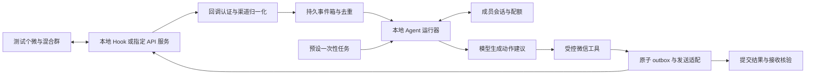

# 个微 Agent API 接管实现 Spec v0.5

日期：2026-09-16。状态：访谈决策已确认；本文件定义下一轮实现，API 通道和新运行时尚未实现、部署或实机验收。

配套：[操作提示词](personal-wechat-agent-implementation-prompt-v0.5.md)、[网关调研](personal-wechat-agent-api-gateway-research-2026-09-16.md)。代码基线：`main`，`8c0e899f9e64b97d44f1a3ea34ee23eb26c8a31c`，文档编写前工作树干净。

## 1. 目标与本版效力

把个人微信接成现有 Agent 的消息渠道和受控 API 工具。在当前唯一测试个微与唯一企微/个微混合测试群中，收到真实 @时及时文字回复；预设任务到时原生 @指定成员询问，并在有界会话内继续交流。借鉴 OpenClaw 的渠道、事件、会话、工具分工，不部署 OpenClaw、不更换现有项目。

本版取代 [9月15日 API 发送方案](personal-wechat-agent-api-send-architecture-2026-09-15.md)的“第一期只换 Sender”路线。**API 同时负责收发；UIA 暂停，本地数据库退出新主链路。** 旧代码、旧配置与证据保留；不自动回退 UIA、SendKeys、数据库轮询或其他账号。历史 WAL 和桌面 T4 未闭合不再阻塞 API 接入，但仍保留原判定，新证据不能倒填旧 T1/T2/T4。

这里 API 是暴露给 Agent 的能力边界，不限定为 Pad 协议或第三方 SaaS。已结合用户补充的方案摘要，纳入 `PC 微信 → 本地 Hook/RPC → WeChat Adapter` 与 `协议/设备服务 → HTTP/Webhook → WeChat Adapter` 两类后端，统一由 Adapter 归一化。WCFerry 原版已归档且发布版配套 3.9.12.51，尚无本机 4.x 兼容证据，详见网关调研；本版不把它写成即装即用依赖，也不新增自研 Hook、客户端降级或注入执行步骤。

本轮授权是调研和编写文档。后续用户使用配套提示词才启动相应开发或实机阶段。文档不等于已经登录、发送、调用付费模型或创建后台任务。

## 2. 已确认决策与具体默认值

| 项目 | 本轮契约 |
|---|---|
| Agent | 保留本仓库；模型解释问题和生成动作建议，程序校验并执行 |
| 微信渠道 | API 接收事件、发送文本、原生 @；具体供应商待能力核验 |
| 网关调查 | 优先本机/自有服务器；可比较托管；不购买、不部署、不登录 |
| 账号与群 | 沿用当前本地已绑定测试号和混合群，接入 API 后重新验证映射；不照抄公开文档里的示例 ID |
| 被动触发 | 绑定群任意已识别非本人成员，真实仅 @本人且有非空文字问题 |
| 问答 | 通用问答，不接业务知识库；一条最多 300 Unicode 字符；单条输入最多 2000 字符 |
| 主动任务 | 配置中预设，准备就绪并显式启动后 120 秒执行一次；1–2 个指定目标，各一次原生 @ |
| 对话延续 | 定时询问后允许目标成员相关回复无需再次 @；首次询问提交成功起最多 600 秒，每人最多再发 3 条 |
| 自动结束 | 已收齐问题所需答案、拒绝/停止、超时或次数耗尽；无回复不催促 |
| 同时运行 | 主动会话与被动 @回复共存，同一事件只能选一条处理路径 |
| 操作面 | 本地配置与 CLI；群聊不能新增/修改任务、绑定、权限或预算 |
| 周期任务 | 设计未来字段和验收入口；本轮不启用每日/每周调度，不创建 Windows/Codex 自动化 |

以下为实现默认值，不宣称是实测性能：每成员 10 秒发送冷却；模型总时限 12 秒；发送排队最多 3 秒、HTTP 请求整体最多 8 秒；被动回复来源时间超过 30 秒不得新提交。正常时效目标仍为至少 9/10 在 15 秒内、10/10 在 30 秒内接收端可见。

未提供实际业务询问内容。本轮固定使用技术验收模板：

> 这是一条 Agent 接入测试。请回复是否收到本条消息，以及现在是否方便继续测试；无需提供业务信息。

需要收集 `receipt` 与 `willingness` 两项。此模板用于验证追问和收尾，不代表用户配置了真实业务任务。原 v0.4 的两位目标仅是候选身份线索，启动前读取本地绑定并经 API 重新消歧，不能把示例姓名或文档占位符当真实收件人。

## 3. 当前实现与需替换的边界

本次已读 `models.py`、`config.py`、`runner.py`、`sender.py`、`live_guard.py`、`general_qa.py`、CLI/Store 的相关入口及 T3/T4 证据。

| 当前代码/证据 | 本版处理 |
|---|---|
| `models.py` 只有四个旧 mode，Event 的消息 ID 按整数解析 | 保持旧契约；API 事件使用新版本结构和字符串 ID |
| `Runner` 从 Reader 读取并创建草稿，没有 API 工具执行闭环 | 新增有界 API 事件运行器，不将旧草稿 runner 冒充 Agent 接管 |
| `Sender.send_text(binding,text,window)` 强耦合窗口和逐条审批 | 旧接口保持；新 API 工具使用绑定证据及运行许可，禁止伪造 `WindowState` |
| `live_send_blockers` 要求 `manual_send` 与窗口 observer | 新配置/入口单独校验 API 能力；不全局放宽旧守卫 |
| `GeneralQA.answer(question)` 为单轮纯文字，HTTP 适配已有 | 可复用请求、超时和响应校验；多轮结构化决策需新契约，不宣称现已支持 |
| T3 是独立模型调用证据 | 不代表工具决策、多轮会话或微信闭环通过；新行为单独测 |
| [T4 ACK1](../poc/evidence/t4-ack1-2026-09-15.md)发送尝试为 0 | 保持未执行；API ACK 使用新阶段、新 run_id |

所有下文新模块、命令、类型、配置均是**待实现接口**，不得直接当作当前可运行能力。

## 4. 设计比较与选择

| 方案 | 调用方契约/例子 | 隐藏的职责与依赖 | 成本与故障特点 | 判定 |
|---|---|---|---|---|
| 仅替换 Sender | 旧 `send_text(binding,text,window)` | 只隐藏 HTTP 发送，Reader/WAL/窗口留给上层 | 改动少，但不能形成 API 收发渠道；错误窗口抽象持续扩散 | 不采用 |
| 一体化桥接 Agent | `bridge.handle_callback(body)` 内调用模型并发送 | 收发、模型、会话均在网关进程 | 首次接通快，但厂商变化牵动业务，难以独立核验预算和越权 | 不采用 |
| 渠道适配＋本地有界运行器 | `channel.normalize(raw)`；`runtime.accept(event)`；`tools.reply(text)` | 厂商 I/O 藏在 channel；去重、会话和预算藏在 runtime/store | 增量成本中等，故障按接入/决策/提交分层；可以使用同一 fake channel 验收公开契约 | **采用** |

保留一个进程、一个本地 SQLite 状态库和一个厂商适配边界即可；不引入消息总线、通用插件平台、MCP 服务、多 Agent 或框架迁移。模型、时钟、channel 在入口注入；SQLite 使用真实临时库测试，厂商网络使用 fake/本地 HTTP 桩。



## 5. 微信渠道契约

### 5.1 能力与身份

`probe(binding) -> ChannelEvidence` 至少给出 provider/版本、实际登录账号、会话世代 `session_epoch`、在线状态、目标群是否存在、目标成员映射、观测时间和能力标志。`resolve_members(binding, candidate_refs)` 仅查询目标群所需元数据，不遍历聊天历史或无关通讯录。

配置中的账号与群只是期望值，须与 API 独立返回值一致。提供方群/成员 ID 与历史 DB 的 ID 必须逐项比对，不假定同字符串/同后缀必然等价。显示名和企业名仅供人工辅助，发送使用稳定键。无法证明账号或群唯一时不武装；重登录/换设备/账号或绑定变化使旧运行许可失效。

每次提交前在线及绑定证据不得早于 5 秒；退出、群移除、成员离群事件使相关证据即时失效。若网关无此类事件，提交前重新查询相关身份。已知移除/下线优先于较早在线响应。

### 5.2 统一消息事件

`ApiMessageV1` 必填：

| 字段 | 语义 |
|---|---|
| `schema_version` | 固定 `wechat-api-event/1` |
| `provider`, `account_key`, `conversation_key` | 实际渠道、本人账号、群路由键 |
| `native_message_id` | 原生唯一 ID，始终按字符串保存，不经浮点或整数强制转换 |
| `event_key` | 由 provider＋账号＋群＋原生 ID 构成；不含 run_id 或会话世代，避免重启后失去去重 |
| `session_epoch`, `occurred_at`, `received_at` | 会话世代、来源时间、入口接收时间；UTC、带时区 |
| `sender_key`, `identity_status`, `is_self` | 结构化成员身份；本人状态 true/false/unknown |
| `kind`, `text`, `mention_status`, `mention_keys`, `mention_all` | 文字/系统/其他；真实 @的结构和解析状态 |
| `reply_to_message_id`, `history_status`, `parse_status` | 可选引用原消息；历史 true/false/unknown；解析状态 |

不把昵称、正文 `@某人`、引用里出现的 @当结构化 @。被动触发要求 `mention_keys` 恰为本人、非 @所有人，身份明确且非本人；缺字段为 unknown，不回退文本猜测。规范化账号级系统事件可使运行暂停，但普通聊天正文中的“下线/验证”等词不能伪装成网关状态事件。

`normalize` 只转换版本已知且通过 schema 检查的数据；unknown 消息不调用模型。重复 ID 正文冲突记 `event_conflict` 并暂停，不能覆盖旧正文。非绑定群和私聊在正文持久化及模型调用前丢弃，仅累计匿名计数。

### 5.3 回调入口与新消息基线

本节以 Webhook 描述接收边界；本地 Hook 的 RPC/消息队列经桥接归一化进入相同事件箱。若原 SDK 不提供消费确认或重放，必须记录丢失窗口，不能伪造 Webhook ACK 或游标；桥接进程退出视同渠道断开。

1. 使用网关真实支持且已验证的验签/认证；不要自创一个供应商不会发送的 HMAC 字段。无鉴权时只能在经过验证的受控私有通道增加可信桥接认证；无法证明来源则不能武装自动回复。限制请求体 256 KiB、禁用 XML 外部实体，不记录原始 token/body。
2. 接收器仅做认证、基本校验、范围过滤、持久写入和应答；目标 1 秒内，必须满足供应商期限。模型与发送由 worker 异步处理。入库失败不返回伪成功；供应商不支持重投时记覆盖缺口并暂停，不宣称消息零丢失。
3. 启动时先同步/记录基线，后置 `armed_at`。历史/重放、基线前、超过 30 秒或无法证明新鲜度的消息不触发；未来时间超过容许时钟偏差 5 秒也不触发。重启时同步的旧消息不能因“刚收到回调”而变成新消息。
4. 断线、重连、时钟异常和队列最老消息年龄超过 30 秒时暂停新发送。重连只恢复观察；旧凭证撤销、旧待发取消，操作人重新启动产生新基线，不补答积压消息。
5. 对事件接收允许重复投递；业务动作最多一次本地提交尝试。没有网关写入幂等能力时，不承诺端到端 exactly-once。

### 5.4 发消息契约

`submit(OutboundCommand) -> SubmitResult`：命令由 runtime 构造，包含 `action_id`、绑定版本、账号/群、允许的 mention_keys、正文、截止时间。厂商 URL、鉴权、字段名称、JSON 编码只存在具体适配器中。

| 结果 | 判定与后续 |
|---|---|
| `not_submitted` | 能证明未交给提供方执行，或供应商明确定义为未执行的业务拒绝；记录失败，不自动重试 |
| `accepted` | 符合固定版本的业务成功契约，保存提供方消息/请求标识；只表示受理，不能写 verified |
| `unknown` | 发出后超时、断连、无法解释的响应、崩溃或无法证明未执行的错误；暂停整个 run，不重试 |

HTTP 200 需继续核业务响应；5xx/代理错误不能一律归为未发送。禁止隐式 POST/RPC 写请求重试和带凭据跨域重定向。每个 `action_id` 最多一次发送调用，即使提供方宣称幂等，首版也不自动补发。WCFerry 类 SDK 须检查底层 `_send_request` 的重试和异常默认返回值；只在上层“不重试”不能满足此契约。SDK 整数返回码需按已核实协议映射，不能当作接收端证明。

发送状态 `reserved → submitting → accepted / not_submitted / unknown`；接收证据另列 `unverified / verified / failed`。API 回显、原生 @投递能力和真正送达分开记。首次通道验收需要企微接收端＋个微观察端核验；后续有界测试无须逐条批准发送，但仍逐例记录实际接收证据，不能用 API 受理覆盖缺失的核验。

## 6. Agent 工具、路由与内容

### 6.1 最小动作面

| 动作 | 谁可请求 | 参数与约束 |
|---|---|---|
| `reply_text(text)` | 当前合格事件的 Agent 决策 | 群从执行上下文注入；被动回答不另 @提问人 |
| `ask_target(text)` | 预设任务首次触发，或相关会话内的追问决策 | 目标仅为上下文中的单一目标成员；首次原生 @，后续回复默认不重复 @ |
| `close_session(reason)` | 规则或 Agent | 本地状态动作；默认不发送额外结束通知 |
| `ignore(reason)` | 规则或 Agent | 无发送副作用 |

这些是本地受控工具，不把网关的任意 HTTP 请求能力或 token 交给模型。模型没有可填写的账号、群 ID、成员 ID、URL、文件路径、预算或调度时间字段。一次模型输出只接受一个动作建议；禁止模型循环调用工具。`reply_text`、`ask_target` 都必须经过同一发送入口和 outbox。

首版以结构化 JSON 决策适配当前模型，不依赖供应商原生 function calling。决策结构：`action=reply|ask|close|ignore`、`relation=related|unrelated|uncertain`、`text`（无发送时 null）、`slot_updates`、`reason_code`。允许字段、枚举、文本长度和 slot schema 严格校验，额外路由字段或非 JSON 拒绝；不二次请求“修 JSON”。

### 6.2 事件路由顺序

在原子事件认领后按下列顺序执行，不能同时进入两个流程：

1. 本人、历史、跨群、解析/身份不明、过期事件直接忽略。
2. 当前目标成员明确要求停止/拒绝，立即结束其活动会话并取消未提交动作；冷却不阻挡停止指令。已提交结果保留，不能承诺撤回在途请求。
3. 事件属于该成员唯一活动的主动会话，且无 @他人/@所有人冲突，进入会话关联判定；明确引用该会话外发消息可作强关联。无引用时，只给该目标会话的有限上下文与当前消息，模型输出 related/unrelated/uncertain。
4. related 使用主动会话；uncertain 且未真实 @本人则不插话；unrelated/uncertain 但符合真实 @触发条件时，可采用同一次决策已生成的独立问题答复，不改主动会话、不再次请求模型。没有有效答复则忽略。
5. 无活动会话时，仅真实 @本人进入单轮问答。普通群聊、@他人、纯文字假 @、@所有人不触发。

关联与答案/追问合为一次模型请求。运行器在调用前注入只读 `allow_standalone_reply`（是否满足真实 @条件）；模型只能据此在不相关时给本条问题的独立答复，不能自行开启回退。`relation` 是可出错的语义判断，不作为账号或目标权限依据；测试必须覆盖目标成员与别人聊天、短语“好的”歧义和引用错误。无法可靠区分且不满足真实 @条件的案例保持静默，并在报告中列出未覆盖语义。

### 6.3 模型数据范围与失败

无活动会话的被动问答仍只发固定系统提示词＋本次问题。主动会话关联判定只发已配置询问目标/slot schema、本会话目标成员的已关联输入、当前待判定输入及 Agent 自己已受理的输出；最多当前输入加最近 3 对消息，总文本不超过 8000 字符。当前输入即使最后判 unrelated，也已用于这次有界关联判定，应在外发范围中说明；独立答复不得借用其他任务上下文。不得附其他成员聊天、全群历史、昵称、内部 ID、原始回调、密钥或群元数据。仅上下文裁剪不能截断当前问题或改变任务目标，超限拒绝并记原因。

这明确扩展了 v0.4 的“每条独立、不带任何历史”：仅主动会话允许有限本会话上下文。A4 提示词包含这项外发范围；文档编写不触发外发。默认沿用已有 M3 适配与凭据引用，实施时核实实际接口，不在本轮调用模型。

模型不能从聊天指令改变系统规则，不跟随消息中的链接取文件，不调用 shell、浏览器、任意网络或业务系统。工具执行状态必须来自运行器，不能把模型的“已经发了/已安排”当事实。认证/额度错误暂停模型路径；超时/无效输出记录失败，不生成额外自动兜底消息，不重试，迟到答案作废。

## 7. 主动会话与预设任务

`InquirySession` 主键含 run_id、task_id、account_key、conversation_key、target_key；同一账号/群/目标最多一个活动会话。两人询问是两份独立会话，不将二人的答案拼进同一模型上下文。

状态：`scheduled → initial_submitting → awaiting_reply → closing_pending / completed / declined / expired / exhausted / cancelled / uncertain`。第一次发送 accepted 后记录 `opened_at` 和 600 秒截止时间，截止时间不得超过整个 run 的截止时间。不因收到新消息自动延长。

技术模板固定 slot 值域：`receipt`、`willingness` 均为 `true / false / unknown`。目标只回“收到”时填 `receipt=true`，若 `willingness` 未知可追问一次是否方便；明确“没时间/停止”直接 declined；“收到，现在方便”满足两项后可给一句简短确认并 completed。需要最后一句确认时，在同一事务中预留动作并置 closing_pending；提交 accepted 后 completed，unknown 则 uncertain，无提交/失效则关闭并记录未发确认。closing_pending 只允许这条已预留确认，仍可被停止/超时取消；直接close则无需该中间状态。确认消耗追加回复与预算，已关闭后不得新增消息。无人回复则到期关闭，不自动提醒。

`slot_updates` 必须符合固定字段和值域并引用本次输入；停止/拒绝由规则优先，模型不能覆盖。最多追加 3 条发送尝试，包括追问、确认及失败尝试；次数达到上限即结束。模型判已完成时也需程序检查必填项，防止缺答案提前关闭。

任务持久化字段：`task_id`、`task_version`、绑定版本、目标键列表、template_id、`required_slots`、`schedule_kind=once_after`、`delay_seconds=120`、`timezone=Asia/Shanghai`、due/expiry、status。每目标幂等键为 task_id＋task_version＋计划时刻＋目标键，不使用当前时间临时生成以绕过去重。

准备完成后才启动单调计时；到期后 10 秒内开始提交两名目标的首次询问，逐人串行并各自记录时刻，第二人也须满足窗口。每次提交同时检查冷却，若无法在窗口内满足则记取消，不延期偷偷补发。重启、暂停或错过窗口一律取消该次任务。未来周期任务可预留 `schedule_kind=recurring`，首版解析器明确拒绝启用，不伪装为已上线能力。

## 8. 许可、预算、并发与存储

### 8.1 运行许可和预算

API 新入口采用独立 `api-config/1`；旧 `mode` 不增枚举。新 profile 为 `offline / observe / bounded_agent`。默认两个 live 开关 false；observe 允许接收和元数据探针，禁止模型与发送。`bounded_agent` 必须同时具有显式启动凭据、准确范围、有效前置证据和所需 live 开关。

运行许可记录 run_id、spec/config 版本及哈希、账号/群/绑定指纹、session_epoch、允许动作、起止时间、目标/模板/slot schema、模型预算、发送总额及分项额度。它只能由本地操作入口在明确启动阶段时生成；普通 TOML 布尔值、回调和模型输出不能独自授予发送权。运行停止即撤销，不伪造旧 approval_id，不继承历史运行许可。

| 阶段 | 时长上限 | 模型请求上限 | 发送尝试上限 |
|---|---:|---:|---:|
| A0–A1 离线 | 无实机运行 | 0 | 0 真实发送 |
| A2a 接收观察 | 30 分钟 | 0 | 0 |
| A2b 固定 ACK | 30 分钟 | 0 | 3 |
| A2c 原生 @ | 10 分钟 | 0 | N，N 为已指定目标数，1–2 |
| A3 被动回复 | 30 分钟 | 10 | 10 |
| A4 主动会话＋被动并存 | 30 分钟 | 30，总内被动最多 10、主动最多 20 | `10 + 4*N`，N=2 时共 18；被动最多 10，主动每人首次 1＋追加 3 |

关联判定、忽略决策也消耗模型预算；每事件最多一次模型请求。先进入活动会话判定的请求消耗主动模型额度，即使最终独立回答真实 @问题也不重复扣模型额度；最终发送按实际路由扣主动或被动发送额度。每成员 10 秒发送冷却与一条模型任务并发锁；stop 处理不占模型预算。所有任务共用账号级单一发送锁。模型额度耗尽拒绝新模型请求，已占位的最后一个请求仍可在有效期限和剩余发送额度内完成一次回复；发送额度耗尽拒绝新提交，在途结果继续记账。分项耗尽关闭对应新工作入口；总额耗尽且已有工作收尾后停止。时限、显式停止或unknown触发立即撤销许可，丢弃未提交结果。

发送配额在网络交接前同一 SQLite 事务中原子扣减并落 outbox，任一已扣额度不回补，避免以“失败”为理由突破试验次数。纯前置拒绝不消费发送额度。每次事务还需重查事件占用、运行许可、成员会话状态、冷却、deadline、绑定版本和 pause 状态。

### 8.2 新状态库与崩溃恢复

使用独立 `poc/.local/api-agent/state.sqlite`（`PRAGMA user_version=1`），不迁移/覆盖旧 Store 数据。持久表至少包括 `bindings`、`runs`、`inbox`、`tasks`、`sessions`、`outbox`、`receipts`、`audit`；契约聚合放入一个 `ApiStore`，无需一表一模块。状态库跨 run 保留去重键；每 run 另建脱敏证据目录。

事务保证：事件唯一入库、原子认领、模型请求占位、会话版本比较更新、原子额度和动作占用。网络请求在事务外执行。启动发现 `submitting` 动作，全部标为 unknown 并保持暂停；发现旧 ready/reserved 但未交接动作，取消而非重发；旧运行不自动恢复。

同成员处理期间的新消息可进入持久队列；停止/拒绝优先处理并提升会话版本。模型返回前后均核对版本，旧版本结果不提交。完成/过期/停止之后仍保留审计，不再纳入模型上下文。

正文和本会话上下文仅存本地忽略目录，默认保留 7 天后列清理项；必要去重键/状态墓碑至少保留 30 天，不含正文。早于当前 armed_at 的消息始终不触发，不能因删除正文重新变成新事件。日志和可提交报告使用案例编号、匿名目标、计数和耗时，不提交原始回调、二维码、token 或数据库。

## 9. 配置草案与代码落点

以下 TOML 是未来 `api_cli` 的 schema 示例，不可交给当前旧 CLI；所有目标为空时只允许 offline，live 必须拒绝占位值。

```toml
config_version = "api-config/1"
profile = "offline"
allow_live_read = false
allow_live_send = false
authorization_ref = ""
state_path = ".local/api-agent/state.sqlite"
evidence_root = ".local/api-agent/runs"

[channel]
provider = "fake"
contract_version = "wechat-api-event/1"
base_url_ref = "env:WECHAT_GATEWAY_BASE_URL"
credential_ref = "env:WECHAT_GATEWAY_TOKEN"
provider_profile_path = ""

[binding]
account_key = ""
conversation_key = ""
binding_version = ""

[agent]
model_provider = "mock"
credential_ref = "env:MINIMAX_API_KEY"
max_input_chars = 2000
max_output_chars = 300
context_max_chars = 8000
model_timeout_seconds = 12

[run]
stage = "A1"
max_seconds = 1800
member_cooldown_seconds = 10

[inquiry]
enabled = false
schedule_kind = "once_after"
delay_seconds = 120
start_grace_seconds = 10
timezone = "Asia/Shanghai"
template_id = "connectivity_receipt_and_willingness_v1"
target_keys = []
session_seconds = 600
max_followup_attempts = 3
```

额度按 stage 的不可扩张上限生成，配置仅可调小。启用 inquiry 的 profile 只能为 A4；真实 ACK/原生 @使用各自固定测试入口，不通过随意填正文复用自动运行入口。未知字段、错误类型和嵌套错位的 allow 开关直接报错，不能静默武装。

| 建议落点（`poc/wechat_agent_poc/`） | 职责 |
|---|---|
| `api_channel.py` | 事件/提交/身份结构、fake channel、选定厂商适配；实现过大时才拆厂商文件 |
| `api_runtime.py` | 事件路由、任务计时、受控工具、额度/冷却/停机编排 |
| `api_store.py` | 新状态库、事务、状态机与恢复 |
| `agent_policy.py` | 单轮/主动会话输入构造、结构化模型决策与输出检查；复用既有 HTTP 原语 |
| `api_cli.py` | 独立配置与阶段入口；明确拒绝旧配置/未知 provider |

建议 CLI 契约：`api-check`（默认不联网；显式 probe 才观察网关）、`api-observe`、`api-ack`、`api-mention-test`、`api-run --stage A3|A4`、`api-status`、`api-stop`、`api-verify`。参数、exit code 和 `--help` 随实现固定；这些不是现有命令。状态/停机命令不能启动网络、模型或发送；`api-verify` 仅记录人工证据，不触发补发或恢复。

API 路径不得 import 或调用 `weixin_uia.ps1`、`ObservedDesktopSender`、取钥/SQLCipher 采集入口。网关的底层实现机制另按 provider-profile 记录；不能把“HTTP API”当作底层一定无设备依赖的证明。

若采用本地 Hook，另在独立桥接进程封装现有、经版本核验的 SDK，Agent 主进程不加载 DLL、不持有任意 SQL 查询能力。对 Agent 的接口仍限本 spec 的收发和身份元数据；SDK 里其他能力不暴露。先核实当前准确客户端版本和具体维护来源，不能擅自降级微信或用“先注入试试”代替兼容性核验。

## 10. 实施阶段与验收

### A0 — 候选与适配条件

完成 provider-profile 模板、可获得性/费用/部署边界核验及候选排序。没有真实服务可继续 A1，不猜测成功响应或原生 @字段。涉及外部采购/托管/部署的具体选择在其执行前确认。

### A1 — 本地 API Agent 闭环

实现新配置、fake channel、事件箱、运行器、结构化模型桩、工具、主动会话、一次性计时、outbox、停机/恢复及 CLI。使用临时 SQLite 和 fake clock 验证 A3/A4 全路径，真实网络、微信和 M3 均不调用。

必须验证：回调持久化后应答；认证失败；版本/字段缺失；跨群/本人/伪 @/多对象 @；同 ID 重复与冲突；历史/重启同步；停止与模型完成竞态；两会话隔离；API 200业务失败/5xx/超时；崩溃窗口；多 worker 原子预算；模型额外路由字段；静默不催促；错过定时窗口；任务重启不补发；旧 UIA/DB 路径零调用。

先最小相关测试，再运行 `poc` 既有完整 pytest 回归一次。旧 `manual_send` 和默认 live=false 保持行为。A1 成功只能报告“离线闭环通过”。

### A2 — 当前账号/混合群渠道验收

独立启动三段，每段新 run_id：

- **A2a**：API 只读观察 30 分钟以内。身份/新消息基线后，企微与个微各 10 条独立文字消息，共 20 个不同原生 ID、20/20、无重复入业务。若群内个微只有测试号，可由操作人手机手工发送作为本人反例，不能算非本人问答正例。实机真实 @本人、@其他人、伪 @、引用 @、普通群聊各有样本；@所有人无权限时保留未执行，合成反例仍必测。无 API 实机反例时不得宣称触发分类全面通过。
- **A2b**：无模型，原群固定 `POC-API-ACK-<run_id>-001..003`；先第 1 条双端核验后再发第 2/3 条。3/3 可见、零错群。错误目标反例通过本地可观测 HTTP 桩验证，不真实向错误群探测。
- **A2c**：对已消歧的每名目标各发一条固定原生 @测试；目标端实际识别 @，不能只看正文。企微目标必须单独有成功证据。无可验证企微原生 @时 A3 可独立继续，A4 不得启动。

A2 同时记录具体版本、网络/时区、账号/群匿名指纹、会话冲突和回调认证方式。文档声明与真实观测分列。

### A3 — 被 @自动回复

依赖 A1、A2a 的身份/新消息/必要 @分类证据、A2b。先 1 条成功，再最多余下 9 条。合格正例共 10 条，每条一次模型调用、最多一次发送；同成员间隔满足冷却。10/10 唯一正常回复，至少 9/10 ≤15秒且 10/10 ≤30秒接收端可见；任一模型/发送失败算该案例失败，不用追加第 11 条覆盖失败。

同时观察普通聊天、本人、伪 @、重复事件零发送。缺 @所有人实机权限不冒充已测；只可判“通过当前限定场景”并列限制。记录 source/receive/model-start/model-end/submit/receiver 六个时间点及测量方式，缺来源或接收时刻则时效未验证。整个 run 上限 30 分钟/10 次模型/10 次发送，先到即停止。

### A4 — 单次定时询问＋有界对话

依赖 A3 与 A2c。最多 2 人，120 秒后各 1 条技术询问；主动每人追加最多 3 条，10 分钟不延长；同时允许已验收的被动回复，所有分项/总额按 §8。

成功标准：首次询问到期后 10 秒内开始提交、各目标只收到 1 条且真实被 @；相关回复无需再次 @能进入本人成员会话；任务所需答案收齐后关闭；无回复/拒绝/次数耗尽后没有额外催促；混入无关群聊零插话；主动/被动竞争同一事件最多一次回复。实机至少包含一次缺项追问和一次停止/完成场景；无法安排的场景保留未执行，离线反例不得冒充实机。

不为凑满 3 次追问强行继续已完成的对话。被动时效沿用 A3，主动会话回复也记录相同六时刻。迟到取消算取消，不能记定时通过。周期能力、长期在线和真实业务采集均不在本轮验收范围。

## 11. 完成判据、交付和未决项

实现交付至少包含：可运行离线示例、固定版本接口/schema、相关和完整回归结果、新配置说明、真实厂商适配记录（若已选定）、阶段操作记录及限制。使用“通过当前限定场景 / 部分通过且有限制 / 未通过 / 未执行”，分别报告实现、离线验证、API 通道、Agent 闭环和接收端证据。

当前可开始 A0–A1。剩余真实接入条件如下，不阻挡本次文档或离线开发：

| 缺项 | 最晚确定点 | 不满足的行为 |
|---|---|---|
| 可用网关、版本、交付/费用、数据路径与部署位置 | 安装或接入前 | 不部署、不购买；保留 fake |
| 回调可达和认证、准确协议字段及混合群能力 | A2a 前/中 | 不武装，缺陷有证据记录 |
| 当前账号、群及企微目标的 API 身份映射 | A2 对应阶段前 | 不以历史昵称或占位符替代 |
| 企微/个微接收核验安排 | A2b 前 | 可完成实现，真实发送不启动 |
| 实际业务问题和答案字段 | 未来业务任务前 | 本轮仅用明确技术模板，不生成业务任务 |
| 每日/每周时段、目标名单、长期额度、运维负责人 | 周期运行前 | 首版拒绝 recurring，不创建后台调度 |

本轮实现路线已收敛；无需为以上已确认架构再重复访谈。新的成本、外部托管或实际业务目标由具体证据触发决策。
