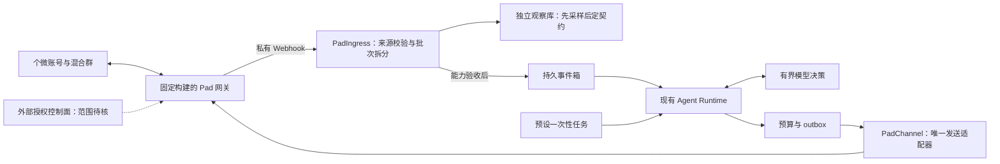

# 个微 Agent v0.6：WeChatPadPro 自建通道方案

> Windows 861 修订入口：[固定构建实现决策](wechatpadpro-861-implementation-decision-2026-09-16.md)。本版中的 MAX 优先、Webhook 优先及部署假设对该构建已被修订；业务上限保留，真实能力仍待验收。

日期：2026-09-16。状态：设计完成，待分阶段实现与验证。技术依据见 [调研报告](wechatpadpro-technical-research-2026-09-16.md)，执行边界见 [实施提示词](personal-wechat-agent-implementation-prompt-v0.6-wechatpadpro.md)。

## 1. 目标与本版效力

保留现有 Python Agent，重点验证 WeChatPadPro 自建协议网关，支持当前单个个微账号在唯一混合测试群内：真实 @本人触发文字回复；预设任务到时原生 @指定成员，并完成有界对话。

本版调整后端选择、接收契约和验证阶段；v0.5 的业务边界、内容约束、路由优先级、会话隔离与预算继续有效，冲突时以本版的 Pad 专属要求为准。GeWe 代码/证据保留；暂停把 GeWe SaaS 公网接入作为新路线默认前提。UIA、数据库 Reader 不进入新链路，不设置自动回退。研究设计不授权部署、采购、扫码或发送。

当前可执行的是**本地离线适配和契约准备**。真实构建版本尚未锁定，不能把 `wechatpadpromax08`、旧 v861、README v875 统称为一个已支持版本。

## 2. 业务契约

| 项目 | 保持的行为 |
|---|---|
| 被动触发 | 绑定群、已识别非本人成员、真实仅 @本人、有非空文字；普通聊天/伪 @/引用中的 @不触发 |
| 问答范围 | 通用问答；无业务知识库；输入最多 2000、输出最多 300 Unicode 字符 |
| 主动询问 | 本地预设一次性任务，武装后 120 秒，1–2 个明确成员各一次原生 @ |
| 会话 | 首次提交受理后最多 600 秒，每人最多追加 3 次；完成、拒绝、停止、超时即结束，无回复不催促 |
| 模型权限 | 仅提出 reply/ask/close/ignore；账号、群、成员与时间由程序注入；无任意 HTTP、文件、shell、网关管理能力 |
| 数据范围 | 被动仅本问题；主动仅该目标会话有限上下文，不拼接其他人/全群历史；不把内部 ID、密钥送模型 |
| 时效 | 每成员 10 秒冷却；模型 12 秒、排队 3 秒、提交 8 秒上限；来源超过 30 秒取消；合格回复目标 9/10 ≤15 秒、10/10 ≤30 秒 |
| 调度 | 本轮不启用每日/每周常驻任务；错过首次执行窗口 10 秒则取消，重启不补发 |

业务内容仍使用 v0.5 的“收到与是否方便继续测试”模板，不能据此开始真实客户询盘或业务数据采集。

## 3. 架构选择

| 方案 | 调用契约与例子 | 隐藏职责/依赖 | 取舍 |
|---|---|---|---|
| Agent 直接调用全部 Pad API | 模型决定 URL 与 JSON | 无有效边界，模型承担厂商字段和账号选择 | 初接短，但错误路由、预算和管理权限散落，不采用 |
| Pad 内置自动化/MCP 承担对话 | 将群事件交给网关内置规则 | 业务状态与网关会话、外部模型绑定 | 核心源码/行为未知，与现有 outbox 双执行，不采用 |
| Pad 专用 Adapter + 现有受控 Runtime | `pad.normalize(message)`、`runtime.accept(event)`、`channel.submit(command)` | 厂商认证/字段/探针封装于 Adapter；会话/预算/去重归 Runtime/Store | **采用**，增加批次接收边界，复用已有策略与状态机；可离线检验 |

图中“私有”是部署要求，不是当前已存在的环境。网关与观察器优先放在同一专用主机的隔离容器网络；回调与 Redis/数据库不发布公网端口。管理接口仅本机或受认证管理通道访问。若 Agent 暂留 Windows 而网关在另一主机，则必须设计并验证 VPN/mTLS 链路后再连接，不能把远端回调填成本机 localhost。

首版采用 Webhook，不并行消费 WS、Sync 结果和回调。`/Msg/Sync` 只可由明确的初始化/恢复操作触发，属于影响会话/游标的控制动作，不伪装成无副作用 GET。WS 文档尚标开发中，之后如需替换，单独验收。

## 4. 产品锁与部署约束

建立独立 `pad-provider-profile/1`，不把调研字段混入当前严格校验的 `provider-profile/1`。建议 provider 标识 `wechatpadpro`，另以 `api_flavor=legacy|MAX` 区分；这是待实现标识，当前 CLI 不接受。

必须记录：产品族、release/tag、构建 ID、下载来源、二进制 SHA-256 或镜像 digest、文档导出 SHA-256、协议/API 版本、操作系统、运行依赖、配置摘要、认证形态、数据路径、授权费用/有效期、样本引用和 observed 时间。每项能力分别标 `documented/observed/unknown/unsupported`。更换构建使旧 observed 能力失效。

推荐以 MAX 为契约调查对象，但只有可交付构建与文档匹配后才选定。若只有旧 v861 包可得，建立独立 legacy profile；不得把 MAX 的 `/Msg/SendTxt` 或认证头套入旧包。缺源码时如实使用二进制运行验证，不承诺源码级可审计性。

部署阶段应重新编写最小清单，不能直接 `docker compose up` 公开示例：

- 固定 digest；新生成凭据；MySQL 是否必要按所选构建确认；不把旧版数据库依赖硬塞给 MAX。
- 持久化会话/配置所需目录并验证重启；会话备份按凭据保护。明确 webhook 配置真实来源和读回接口。
- 关闭网关自带发消息、好友、红包、群管理、转发、推广及模型自动化；查明状态读取/关闭方式，不能盲发“切换开关”聊天命令。
- 调查内置任务重试作用域，区分回调重投与微信发送重试。无法排除后台自主动作时，只能在明确接受该限制的隔离测试环境观察，不能称为无发送能力网关。
- 外部控制面、授权刷新和遥测的网络目标/负载由实际构建核实；不默认“纯自建、免费、永不掉线”。

本轮不选择主机、不拉镜像、不启动服务。

## 5. 最小模块与接口

| 模块/入口（待实现） | 职责及调用方约束 |
|---|---|
| `pad_ingress.py` / `PadIngress.accept(headers, raw_bytes, peer_evidence)` | 验来源、限流、解析 envelope、过滤范围、批次拆分并事务入库；不调用模型/发送 |
| `pad_channel.py` / `PadChannel` | 实现既有 Channel 的 normalize/probe/resolve_members/submit；仅接单条已拆分消息，厂商错误转换为领域结果 |
| `pad_observer.py` | 独立只读采样和脱敏导出；仅持有只读 client，不实例化发送适配器/Runtime/模型 |
| `pad_config.py` | 新 `pad-config/1`，显式 observation/agent 库路径、provider profile、凭据引用和 live 开关；未知字段拒绝 |
| 既有 Runtime/Store/Policy | 后续复用路由、会话、预算、outbox；不通过复制整套 GeWe 模块制造第二份业务规则 |

`PadIngress` 是必要边界：现有 Channel.normalize 一次返回一个事件，而 Pad v1 的一个回调包含多条消息。保持 `wechat-api-event/1` 单消息契约，不把 list 偷塞进旧接口，不把同一 envelope 当作一个消息 ID。

认证策略、只读 HTTP transport、Clock 和 store 从入口注入。网络为外部依赖；SQLite/时钟可在本地替换；签名/字段转换为纯函数。第一阶段不为所有 provider 重构生命周期框架；只在确有复用时抽取现有进程锁/心跳/停机逻辑，保留 GeWe 行为与回归。

## 6. 接收、身份与新消息

### 6.1 来源校验

官方 v1 HMAC 仅覆盖 envelope 元数据，不覆盖正文，且测试向量有冲突，详见研究报告。默认拒绝公网仅靠该 HMAC 的自动回复方案。

首选对端身份可验证的私有拓扑：只有目标网关可访问接收入口，禁止任意其他容器/外部进程接入；跨主机采用客户端认证的 TLS 或等价受控通道。IP 范围、server-only TLS、正文账号字段单独均不是发送端身份。

若网关只能发普通私网 HTTP，可在同机隔离网络用专用 relay 接入，再由 relay 对完整原始 body 加内部认证发送至 Agent；前提是 relay 上游的独占通道已验证。relay 不得接收公网匿名请求后无条件加可信头。内部认证仅证明该私有接入链路，不能称为腾讯官方签名。任何文档缺失都不通过跳过验证解决。

文档 HMAC 可作为附加校验，记录 `metadata_signature_valid`；完整来源依据记录为 `private_gateway_transport_verified` 等独立证据，不混用 GeWe 的来源等级。接收 token、签名、原始 headers 不进日志。

### 6.2 批次与持久化

请求体上限暂沿用 256 KiB，并加 100 条/批本地上限；这是防护默认值，锁定构建后核对合法最大批次。持久化完成后才返回该构建接受的 200/JSON ACK，目标入口耗时小于 1 秒；写库失败返回非成功并暂停，不能假定厂商必重投。

整个批次先认证、检查身份/范围，再在一个事务中插入绑定群合格事件；重复项返回已收状态。同原生 ID 内容冲突入冲突记录并暂停业务，不覆盖原文。不合格项仅保存目标范围内的最小拒绝元数据；跨群/私聊正文不落库。有限的目标样本原文由观察器另存受保护目录用于定契约，不传给模型。

一条坏消息不能使同批后续消息静默丢失：记录逐项 disposition。若事务失败则整个批次不 ACK；若未知项被有界隔离且其余入库完成则可 ACK，但标记观察覆盖缺口。没有稳定原生 ID 的项不进入业务队列。

### 6.3 字段映射规则

| v1 来源线索 | 领域字段 | 限制 |
|---|---|---|
| envelope `Wxid` | account_key | 还须与独立本人探针对照；不只信回调 body |
| 每条 `newMsgId` | native_message_id | Python 精确整数解析后转字符串，拒绝 float；不能经 JS Number 中转 |
| 每条 `createTime` | occurred_at | 秒转带时区 UTC；顶层 Timestamp 是事件封装时间，不能替代消息创建时间 |
| fromUser/toUser + 已确认群路由 | conversation_key | 不只凭 `@chatroom` 后缀识别混合群；按实机绑定值精确匹配 |
| 文档的群文本发送者前缀 | sender_key/text | 只在确定版本/路由下拆一次，并验证成员存在；不能任意按冒号拆正文 |
| 每条 `isSelf` | is_self | 与本人身份冲突即 unknown；顶层 IsSelf 不覆盖每条值 |
| 未给真实 @字段 | mention_status | unknown；不能用昵称、pushContent、正文 @或引用推断 |
| 未给历史标志 | history_status | unknown；不能因为收到时间新而置 false |

消息唯一键保持 provider+account+conversation+native ID，跨重启不变。批次序号只用于审计。运行会话 epoch 由实际登录会话证据产生，不能因每次回调生成新 epoch。

只对匹配的 v1 profile 使用上述规则。收到 v2 或版本漂移则隔离/暂停；取得完整 v2 schema 后编写独立解码器，统一到同一领域事件。不得猜测 `atuserlist`、`msgSource`、`isHistory` 等字段在当前 Pad 实际存在。

### 6.4 新鲜度证明

现有 Runtime 要求 history_status=false；保持不变。允许来源是经验证的厂商历史标志，或固定构建上经过恢复测试的同步完成/基线证明，但必须保存推导依据，不是把 unknown 改名 false。

先观察初始化/同步，再记录 durable baseline，最后 armed_at。要求来源时间在基线之后且不超过 30 秒、时钟偏差不超 5 秒；这些时间检查不能单独证明非历史。文档的 `lastMessage` 示例不是已核实的完整重放 API，不能自行当全局单调游标。

连接中断、会话变更、队列滞后或时间异常立即撤销发送许可。恢复先观察、建立新基线、显式重新武装；旧 outbox 和任务不补发。无法证明新旧边界时，完成观察研究后停在该阶段。

## 7. 发送与运行时接入

运行器构造 OutboundCommand；适配器独自持有 URL/Token/字段映射。当前 MAX `At` 和 `Type` 的语义不足，第一阶段只允许本地桩验证已知结构，真实发送须补齐固定构建证据。

发送前在 5 秒内复核本人、在线、群与目标成员证据，按群串行提交。每 action_id 至多一次本地写请求；HTTP transport 禁止写重试和跨域重定向；网关内部重发须另外核验。外部幂等未证实，不宣传端到端 exactly-once。

结果继续使用 `accepted/not_submitted/unknown`。文档成功样例只提供候选映射；固定版本校验 Code、Success、回执 ID 与目标后才记 accepted，双端接收另记 verified。发送开始后的超时、断连、5xx、无法解释响应均 unknown 并停 run，不自动重试。只有可证明尚未调用或明确未执行的拒绝才 not_submitted。

现有 `ApiRuntime.start()` 有 A1 live 硬拒绝、模型只允许 mock；P1 不改。后续 P4/P5 才单独实现 live factory、真实模型装配和阶段许可校验，不删除全局拒绝后靠单个 bool 放行。fake/旧 UIA/GeWe 的保护和行为不受影响。

将 Pad 能力证据按阶段校验，不能只因 provider 名不等于 geweapi 就绕开其硬编码 blockers。必要能力缺失时每个阶段均返回明确 blocker。

## 8. 阶段与可测完成判据

P 阶段是项目验收标签，不是当前 CLI 的 stage 枚举。内部运行额度仍映射既有 A2a/A2b/A2c/A3/A4，修改需明确版本化。

| 阶段 | 工作 | 完成判据与停点 |
|---|---|---|
| P0 产品/契约锁 | 核对交付物、许可/费用、数据路径、API export、样本 | 一份构建对应一份 profile；缺失字段明确 unknown。本轮完成公开调研，但未完成真实构建锁 |
| P1 本地离线适配 | PadIngress、观察器、profile/parser、合成 HTTP/SQLite 测试 | 批次持久化/去重/冲突、签名局限、未知字段拒绝、状态与停机可测；无真实网关依赖，可先做已知部分 |
| P2 隔离部署 | 在选定主机运行锁定网关，关闭内置动作，验证私有回调 | 合成流量来源验证、端口边界、配置读回、重启持久化及日志脱敏通过；没有真实账号也可先验基础设施 |
| P3 只读实机 | 操作人扫码；绑定号/群/成员；最多 30 分钟观察 | 企微与个微来源各 10 条，20/20 不重入；@本人/@他人/伪 @/引用/本人/历史重放有样本；无发送、无模型；缺语义不升级 |
| P4 固定发消息 | 先 3 条 ACK，再每个目标一次原生 @ | ACK 首条双端确认后才继续；3/3 原群可见、零错群；企微目标原生提醒单独有证据；无模型 |
| P5 被动 Agent | A3 许可 + 模型装配，10 个合格 @问题 | 每例一次调用、最多一次提交；10/10 唯一答复，9/10 ≤15秒、10/10 ≤30秒；反例零发送 |
| P6 主动询问 | A4 许可，最多两名目标 | 启动后 120秒到期，10秒窗口内开始；每人首次1条+追加≤3；600秒到期，不催促、不串会话，至少一次追问和一次停止/完成 |

P4 的发送 @失败只阻断主动 @路径；若接收 @与 ACK 已验收，P5 可按独立能力判定。P6 依赖 P5 及原生发送 @。所有未安排或失败的实机案例如实标注，不用合成测试替代。

额度沿用 v0.5：P3 0发送/0模型；P4 ACK 最多3、@每目标1，分 run；P5 30分钟/模型10/发送10；P6 30分钟/模型总30（被动10、主动20）/被动发送10/主动每人4（两人合计总发送最多18）。配置只能降低上限。

P1 必测反例：改变 Data 仍通过文档元数据 HMAC时，不能取得 payload-integrity 能力；无对端认证的请求不能触发业务；批内重复、部分坏项、数据库失败、超大 ID、v1/v2 混淆、本人/历史/假 @、恢复不补发、停止与模型完成竞态、超时结果 unknown。网络 I/O 使用本地桩；不得将测试请求发到公开演示服务。

P2 起需先有具体主机/构建及对应执行授权；P3/P4/P5/P6 分阶段执行，文档提示词不自动授权后续阶段。

## 9. 迁移与回退

1. 新增 Pad 研究/profile/观察路径，独立 `.local/pad-observe/observe.sqlite` 和证据目录；不复用已有 GeWe 观察库。
2. 完成离线接口后只将新 provider 注册到离线工厂；默认 live=false。现有配置仍按原契约解析。
3. 实机证据形成后，使用独立 `.local/pad-agent/state.sqlite` 和绑定版本进入 live 阶段；不能复制旧号/群 key 或搬运未决 outbox。
4. 切换 provider 前先停旧 run并检查在途发送；同一账号只允许一个有发送许可的通道。回退是停止 Pad后人工选定旧路径并重新验收，不能自动双发。
5. 仅扩展 Pad 专有配置时使用 `pad-config/1`，不改既有 api-config/1 的含义。若共享持久 schema 必须变更，先版本化/备份/迁移测试，不覆写旧库。

建议的未来 CLI 是独立 `wechat-agent-pad check|observe|status|stop|verify`，直到实现 help/测试前都只是设计名；P1 不提供可误用的真实 send 命令。观察模式不持有发送 client，不创建 outbox/任务/模型，status/stop 不发起登录或网络探针。

本轮交付仅文档与本地签名公式验证。它将“先做 GeWe 公网 HTTPS”改为“先固定 Pad 构建与契约，做私有观察通道”，并没有证明新网关已可用。
