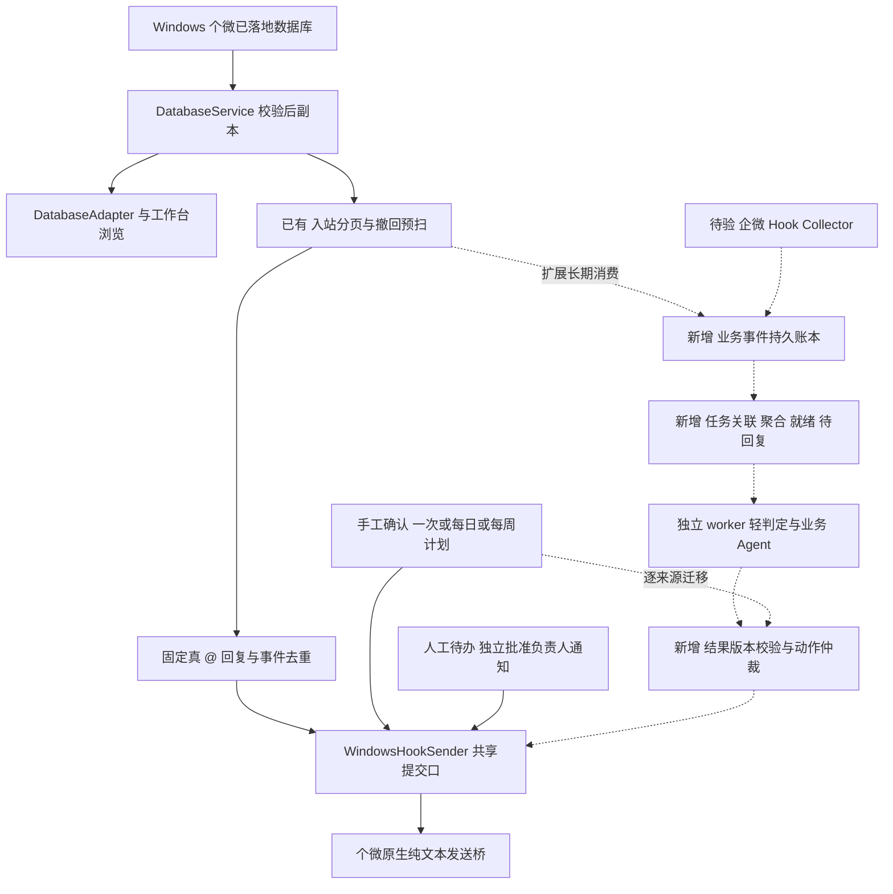

# 企微信息抓取与 Agent 介入策略调研 第二版 本地落地修订

本地续审日期：2026-10-04（北京时间），基线更新至已提交的 `bdafc8177a8600d110af2c0428af07be58f6450f`。本版接续 [10 月 1 日报告](wecom-hook-agent-research-2026-10-01.md)，保持同一报告入口；旧基线的实验保留为历史证据。OpenClaw／Hermes／Jev 核心资料沿用当日已完成的复核，其他外部资料仍为 2026-10-02 快照。本轮重点更新批量定时创建及其事务、业务防重和规模边界，没有复跑产品测试或执行真实客户端、消息、模型操作。[本地续审记录](../evidence/research-current-state-audit.md)

## 1. 结论与本次更新

建议在 Hook 消息接入与业务 Agent 之间设置独立的 **会话与任务编排层**：事件落盘后，先识别任务、聚合碎片、检查输入就绪和当前运行，再决定等待、追问、执行或取消。核心原则是：**一条消息不等于完整输入，一轮输入不等于业务任务，新消息不必重跑整个 Agent。** 群机器人应持续维护任务，只有必要的状态变化才推进执行。

**本地优先路径：复用 WeBridge 已有的数据库副本、入站分页扫描、历史查询和 Hook 发送，补任务级持久事件消费与影子编排。** 自动回复已修复“仅取最近 200 条”的突发漏读，但扫描仍限 120 秒有效窗口，不是长期任务收件箱。当前没有可直接替换接收侧的企微 Hook；它应作为并行兼容性工作包，取得真实字段后再接同一标准事件入口。首期复用 `poc` 的策略、状态版本和预算测试资产，先做规则／脚本影子流程，再接受限业务 Agent；不要求先安装 OpenClaw、Hermes、LangGraph 或 Temporal。

编排层主要使用确定性代码，只在任务关联、意图和就绪判断需要理解含义时调用轻量模型。Windows 已有统一的 Hook 底层提交入口，但尚无统一业务动作事务；`poc` 已有部分 Agent 与任务机制，但尚未接入这条 Windows 工作台链路。后续改造应补上连接与缺失语义，避免把这些能力重新从零实现。

本地已补齐人工待办、群默认负责人及可独立批准的私聊通知，也已有按星期执行、可配置窗口、范围暂停、模板变量和批量原子建任务。下一步研究重点应收敛到长期任务消费、多人关联、模型影子评测与各出口的业务仲裁；已有配置和通知机制直接复用。批量建任务只建立本机计划，通知原生提交也不等于负责人接收端确认；计划配置尚不提供真实 @。

省 token 的主要来源是减少模型唤醒、只传相关事项上下文、按需检索和限制重复调用。Hook 能提供较直接的事件入口，但不自动降低语义推理成本；增加 Agent 数量也不自动省钱。企微 Hook 当前仍缺少本项目目标版本的实机证据，OpenClaw、Hermes 的通道适配不能补足这一缺口。

| 相对第一版的增量 | 本版处理 |
| --- | --- |
| 现有代码是否足以做全量采集 | 更新为已具备 120 秒窗口分页；继续区分长期消费、启用同秒、冷却跳过及群 ID 边界 |
| 哪个 Agent 实施抓取 | 拆开运行期采集服务与开发期 Agent；比较单 Agent、级联、按需专家和广播协作 |
| 如何证明节省 | 增加同等过滤和检索的单 Agent 基线，列出多 Agent 协调和复核的净开销 |
| Jev 的实际定位 | 补充现行公开标价、中文限制、置信度含义及官方已知弱项 |
| 如何判断介入和理解场景 | 区分群、逻辑对话、任务、运行和需求版本，增加就绪接口、待回复记录与时序回放 |
| 如何落地框架 | 比较 OpenClaw 队列、Hermes 委派、Jev 决策、LangGraph 暂停恢复和 Temporal 长流程；保留唯一调度所有者 |

用户提供的 [分享链接](https://chatgpt.com/s/t_6abe0795b4d08191836378c390e0f503) 网页仅返回登录外壳，Browser 重试因组件缺失失败；随后用户在本聊天粘贴了正文，本版已据此补入会话解缠、输入聚合、待回复管理、运行仲裁和长流程恢复。该正文作为用户提供的设计输入；其中框架能力另以官方资料核验，不声称成功读取了分享网页。

## 2. 抓取对象与当前实现的边界

业务基线仍是现有个微／企微混合群；优先保留原群、原接管账号和身份。研究企微客户端 Hook 是一条新增候选路线，不意味着已经决定迁移为企微账号。首期批准范围仍见 [业务需求](mixed-group-business-requirements-2026-09-21.md)：每日模板真 @ 索价、真 @ 下批准场景回复，其余由业务员处理。非 @ 消息可以成为理解上下文的输入，主动回复的授权需要单列策略。

| 路线 | 本轮可确认的作用 | 尚不能推出的能力 |
| --- | --- | --- |
| 企微 Windows Hook | 可研究当前登录客户端可见的消息处理路径 | 未证明目标企微版本、原混合群非 @、两类成员和重连补收 |
| 现有个微数据库副本 | 为 WeBridge 提供读取与结构化消息；适合先验证事件与语义策略 | 不等于企微 Hook；最近消息窗口不是完整事件流 |
| 现有个微 Hook 发送桥 | 可参考版本绑定、防重及结果未知处理 | 不能据此宣称企微收发可用 |
| 官方 AI Bot／自建应用 | 框架可消费被平台投递给 bot／应用的事件 | 插件选项无法让平台产生本来没有投递的非 @ 消息 |
| 会话内容存档 | 保留为独立官方读侧候选 | 当前租户范围、同意条件、延迟和发送能力未补证 |

对现有代码的核验结果如下。它们是实现边界，尚不能直接换算成真实业务漏收数量。

| 当前实现 | 对持续分析的影响 | 后续需要 |
| --- | --- | --- |
| 自动回复通过 `inbound_messages` 分页扫描 120 秒有效窗口；每轮重叠扫描并以持久事件表去重 | 已解除最近 200 条触发限制；物理游标只适用于本次不可变副本，超时消息仍不补处理 | 复用扫描器，补任务事件收件箱、逻辑消费位置与跨代核对；不直接持久化物理游标或假定低坐标不会迟到 |
| 资格判断要求 `activated < timestamp`，消息时间为整数秒 | 启用同秒的消息可能被保守排除 | 以观察序号／事件水位定义启用边界，明确边界消息如何核对 |
| 冷却中事件记为 `cooldown_skipped` | 冷却不是延后执行队列；不能声称稍后补回复 | 将节流、合并、过期、明确忽略分开记账 |
| 重启时规则禁用，未完成 attempt 转为 `unknown` | 属于发送保护，不等于消费游标恢复与全量回放 | 分别验收接收重放和发送核对，unknown 不自动重发 |
| 自动回复绑定要求群 ID 以 `@chatroom` 结尾；数据库合成测试含 `@im.chatroom` | 可展示的群标识不一定被自动回复接受 | 用目标真实群 ID 验证命名空间；不能仅改后缀判断便宣称兼容 |

旧基线的合成实验曾证明 `messages` 默认查询在 205 条同秒记录中只返回 200 条，并复现启用同秒及 `@im.chatroom` 拒绝；这些是 [历史边界实验](../evidence/research-hook-boundaries-2026-10-02.md)，不能再作为当前自动回复漏读的证明。新提交记录已用 201／1205 条突发、跨分片、迟到低坐标和撤回反例验证内部分页修复。它仍不保证客户端未落库、停机或超过有效窗口的消息完整接收。本次核对源码及记录，未复跑这些实验，也未新增企微或混合群实机成绩。[入站改进及验证](../WeBridge/execution/workbench-inbound-2026-10-02.md)

### 2.1 当前 Windows 调用链与可复用资产

`server.py` 的 Windows 默认模式为 `database`，构造 `DatabaseAdapter → Engine → DatabaseService`，再附加 `WindowsHookSender`、`WindowsAutoReply`、`WindowsScheduler` 和本地媒体缓存。数据库模式启动 poll loop 及负责人通知独立线程，自动回复和定时仍在 poll loop 中处理；不启动旧 Live／Demo 的发送与调度循环。不能把 `read_only=False` 当作启用 Agent 的开关，否则会改变账号就绪语义并走入错误通道。[启动装配](../WeBridge/web_mvp/server.py)、[Engine](../WeBridge/web_mvp/backend.py)

| 本地资产 | 已有能力与证据 | 本次建议复用／补齐 |
| --- | --- | --- |
| `DatabaseService`、snapshot／WAL | 检查源变化，构建并校验私有副本，成功切换，失败保留旧副本 | 复用副本生命周期；补增量读取契约、代际持有和明确源健康状态 |
| `DatabaseAdapter`、`inbound_messages.py` | 账号／群／成员、结构化消息；独立入站数值排序分页、撤回预扫及有界缓存 | 复用解码与扫描；补长期消费、缺口及事件字段，不能把窗口游标当任务检查点 |
| `message_history.py` | 已有服务端关键词／日期搜索与游标分页，可查最近窗口以外记录 | 复用查询和读取范围保护；搜索游标绑定副本且会失效，不作为事件总线 |
| `backend.Store` | subscriptions 及 Live／Demo 的 messages／outbox／jobs | 复用读取范围概念；数据库模式 `sync_group` 直接返回，不能假定 messages 表已存当前入站流 |
| `WindowsHookSender` | 持久 draft／幂等、原生绑定、共享提交锁；已支持 `deadline` 与最后探测后的 `before_submit` 授权回调 | 复用已有提交门禁；将任务版本／输入水位接入回调，不另造原生发送器 |
| `WindowsAutoReply` | 真 @ 固定回复、完整启用基线、事件去重与冷却；冻结当次话术和触发消息前 2000 字符 | 保留模板模式和审计；事件表没有保存全部背景消息，不是任务收件箱 |
| `WindowsScheduler` | once／daily／weekly、1–1439 分钟窗口、按账号／会话暂停、逐执行日账本及提交截止检查 | 复用日历与阶段证据；补原生 @ 和真实执行验收，暂停不保证撤销正在处理的一条 |
| `ScheduleTemplates` | 统一纯文本模板、会话变量／覆盖、版本预览，任务冻结完整正文 | 复用内容编写；日期变量不会逐期刷新，文字 @ 不是真实提及 |
| `ScheduleBatches` | 已有 API／界面、1–300 会话预览与同库原子创建；请求回执、摘要及冲突核对 | 复用批次确认与恢复；创建不发送，跨批次业务唯一性及实际容量另验 |
| `HumanHandoffs` 与负责人配置 | 已提交待办、领取／释放／完成／重开、撤回、群默认标签与未分派队列 | 复用 API、界面及行版本；扩展多人任务语义，行版本不能替代需求版本 |
| `HandoffNotifications` | 独立批准私聊 ID、任务与通知同事务入队、线程执行、最终版本核对及结果账本 | 复用动作意图与取消边界；未取得收件端确认，不能把本机分派当通知成功 |
| `execution_history.py` 与工作台 | 三类发送全历史筛选／分页、当次触发快照、账号与读取范围隔离 | 复用证据展示；补任务／需求版本／待回复视图，历史查询本身不是调度器 |
| [PoC ApiStore](../poc/wechat_agent_poc/api_store.py)、[ApiRuntime](../poc/wechat_agent_poc/api_runtime.py) | inbox、task、带版本 session、outbox、预算及迟到结果丢弃 | 复用纯策略、约束和回放用例；API 路线仍限 fake＋mock，关联粒度也需改变 |
| [PoC Responder](../poc/wechat_agent_poc/responder.py) 及独立 M3 模型记录 | 已有 HTTP 模型客户端与独立实验 | 不再写“全仓无模型”；真实模型尚未接到当前 WeBridge 回复链路，接入时另验配置、输出和费用 |

新基线锚点及旧结论替换见 [本地续审记录](../evidence/research-current-state-audit.md)；早期 [接入审查](../evidence/research-local-ingress-2026-10-02.md)、[动作审查](../evidence/research-local-actions-2026-10-02.md) 保留各自时点。未变化的 [PoC 复用审查](../evidence/research-local-poc-reuse-2026-10-02.md) 仍可作为参考。`poc` 的 `run_id`、`task`、`session` 有既有运行控制语义，不能只按名称套成本报告的业务任务和单次模型运行。

新提交还把纯联系人显示名解码错误与身份／正文错误分开，允许按可靠 ID 继续执行并保留显示警告；未知警告仍阻断。同副本撤回预扫缓存改善了单群合成暖缓存成本，但第一次冷扫描没有证明更快，单轮总扫描量也没有固定上限。约 300 群容量应测副本更新、冷缓存、锁占用及同时计划任务，不能把暖缓存毫秒数直接乘群数作承诺。[持续运行记录](../WeBridge/execution/workbench-operations-2026-10-02.md)

数据库 `sourceId` 是源路径与 `selfId` 派生的命名空间，Adapter 仍标记 `identityVerified=False`；它不是独立验证过的客户端登录凭证。来源 ID、本人绑定、快照 revision、读取范围 epoch 与任务需求版本应分别保存。还要区分物理副本和使用范围：现有快照复制单账号业务库，UI 勾选仅限制浏览／使用，不表示副本物理上只包含被勾选群。新语义消费者必须在事件提取和检索入口重新执行范围检查。

### 2.2 真实证据与文档时点

| 能力 | 本地可引用的最高证据 | 尚缺的验收 |
| --- | --- | --- |
| Windows 好友普通文本 | 历史记录有本机回读、好友回复和用户确认 | 不外推为群、附件或真 @ 已通过 |
| Windows 群自动回复 | 较早自动回复记录称尚未有新触发；同日后续定时记录补充两次尝试已有 `local_record_observed` | 不能继续写“从未有本机回复记录”；也不能据此确认对端投递、原生 @ 或长期稳定 |
| Windows 一次／每日定时 | 有合成测试及录制发送替身的浏览器验证 | 历史记录明确未创建真实定时测试任务，真实投递待验 |
| Windows 原生 @ 发送 | `_request` 明确拒绝非空 `mentionIds` | 必须新增字段／ABI适配并验证对端真实提醒，文字 `@昵称` 不算 |
| Windows 媒体 | 已有部分本机缓存与预览验收 | 不等于附件内容已交模型理解，未下载内容及不支持格式不能补猜 |
| Linux 原群与真 @ | `execution/STATUS.md` 明示其后内容为历史 Mac／Linux 环境 | 不能迁移为本台 Windows 或企微客户端实机证据 |

当前已提交记录覆盖人工待办、通知、weekly、窗口、模板与批量创建。最新批量记录记载当轮 516 项 Python 回归通过，包含 300 个合成会话的配置、写入故障回滚、同请求并发和锁边界；浏览器业务 API 全部模拟。本次没有复跑，也不将历史计数当作当前真实群成绩。源码支持“已实现”，合成验证支持对应行为，真实接收与投递仍须独立证明；历史 ready／PID 不说明现在服务在线。[批量验证](../WeBridge/execution/workbench-schedule-batches-2026-10-04.md)、[通知验证](../WeBridge/execution/workbench-handoff-notifications-2026-10-03.md)、[Windows 定时记录](../WeBridge/execution/windows-scheduled-send-2026-09-28.md)、[自动回复记录](../WeBridge/execution/windows-auto-reply-2026-09-28.md)、[当前 Windows 说明](../WeBridge/WINDOWS.md)、[平台说明](../WeBridge/execution/STATUS.md)

### 2.3 现有消息视图不足以直接驱动任务

旧基线的合成核验发现：quote 没有保留目标消息／作者 ID；真 @ 输出只有 `mentionSelf` 等标志，缺完整提及列表；旧附件定位仍用默认 200 窗口，普通消息视图的同秒 ID 按字符串排序。本次源码复核确认这些字段／浏览限制仍需处理，但新入站扫描已经按数值复合坐标排序，新历史查询也已独立分页，不能将旧视图实验外推给这两个接口。历史窗口仍只有文字摘要，没有补历史附件加载。[历史实验与字段明细](../evidence/research-local-ingress-2026-10-02.md)、[历史查询改进](../WeBridge/execution/workbench-history-2026-10-02.md)

新增事件契约应保留稳定来源、平台群、消息／发送人、引用目标、完整提及、撤回目标、原文证据和解码状态；无法取得的字段填 unknown。撤回应成为带目标引用的新事件，而非仅替换当前窗口里原消息的显示文本。游标需按分片／表及经验证的数值复合键维护，不能拿 UI 最后一行或纯秒级时间戳作水位。媒体预览成功、附件已解析、模型已读分别记账；首期不把图片／表格自动理解列为任务层上线依赖。

### 2.4 人工待办与通知的已实现边界

`HumanHandoffs` 已随 `d247a49` 提交，后续 `bd93567` 加入群默认负责人，`d667978` 加入独立批准的负责人私聊通知。待办与通知意图同库事务保存；默认负责人是本机标签，私聊收件人另按已勾选会话的稳定 ID 配置。新配置只作用于新任务，无负责人进入未分派队列，已有任务不被默认标签变化重写。[待办](../WeBridge/execution/workbench-handoffs-2026-10-03.md)、[负责人分派](../WeBridge/execution/workbench-handoff-routing-2026-10-03.md)、[通知](../WeBridge/execution/workbench-handoff-notifications-2026-10-03.md)

通知有独立线程与约 10 分钟有效期，提交前核对来源、读取范围、配置／负责人／任务版本及撤回并持久领取；重启、过期或版本失效的未提交通知不补发，unknown 不自动重试。领取等任务变化可以取消尚未开始的通知，但不能撤回已开始提交的请求。手工、固定回复和定时仍不以待办行状态作为统一业务暂停；一条合格真 @ 一条待办也尚未解决碎片输入、无标记补答和多人关联。

四类发送来源共享进程内发送准入及 Hook 文件锁；全局执行历史仍只汇总原来的手工／固定回复／定时，通知证据在待办详情展示。接收端确认、业务完成与恢复自动化继续独立记账，不依据通知原生调用或本机存档显示“负责人已收到”。[当前动作证据](../evidence/research-current-state-audit.md)

### 2.5 定时配置与批量创建

已提交调度支持 once／daily／weekly，星期按计划时刻的北京时间归属；1–1439 分钟窗口包含截止时刻，最后一次原生提交前再次检查。跨午夜仍记原执行日；重启或恢复只安排未来，过期与 unknown 不补发。按账号／会话暂停只影响定时任务，正在处理的一条仍可能提交，不能当作整个 Agent 的即时停止。[执行日](../WeBridge/execution/workbench-weekly-schedules-2026-10-03.md)、[窗口](../WeBridge/execution/workbench-schedule-windows-2026-10-03.md)、[暂停](../WeBridge/execution/workbench-schedule-pause-2026-10-03.md)

模板预览校验版本、变量和正文，任务保存创建时完整文本；模板后续修改不改变既有任务，日期需明确填写并冻结。`ScheduleBatches.preview()` 与 `create()` 已接入 `POST /api/jobs/batch/preview`、`POST /api/jobs/batch` 及界面能力 `scheduleBatches`。每批 1–300 个已勾选会话，共用日历与窗口，逐目标核对全文；任何变量、摘要、来源、首期时间或写入错误均阻止整批保存，不静默跳过坏目标。[模板说明](../WeBridge/execution/workbench-schedule-templates-2026-10-03.md)、[批量实现及验收](../WeBridge/execution/workbench-schedule-batches-2026-10-04.md)

每个首次创建尝试在源／订阅／Engine 锁外做一次 Hook 状态探测，回来重验预览，在一个 SQLite 事务中保存全部任务与批次回执；并发同请求可能各自探测，但只保存一个批次，此时不调用发送 POST。创建响应丢失时，用原 `requestId`、相同规格与摘要核对原批次当前状态，不新增、不恢复已暂停／取消的任务。当前页面保留原请求供手工核对，浏览器刷新后的自动恢复尚未实现；服务端回执才持久。它是本机创建操作的幂等核对，逐期原生发送的 unknown 仍不能自动重发。

每账号最多保留 500 条定时记录，已结束／取消的记录也占容量。相同目标、全文和日历的 active／paused 计划会被拒绝，但正文不同的两个批次仍可为同群同日分别发送。因此批次请求防重、任务规格防重、业务“每群每执行日一次”是不同约束；新增业务调度需要独立的询价目标与执行日键，再与本机计划／运行关联。整批本机保存成功也不保证各目标同一窗口内全部完成发送。[事务与规模边界](../evidence/research-batch-boundaries-2026-10-04.md)

## 3. 基于 Hook 的进程采集策略

### 3.1 探针和 Agent 分工

Frida 提供函数插桩与进程通信；高频回调和逐条通信存在开销，具体消息字段仍取决于业务适配。Detours、MinHook 同样属于通用基础设施。对本项目，优先验证解码后携带消息身份的分发／落库路径，避免以网络包数、字符串命中或 UI 刷新次数替代消息数。[Frida API](https://frida.re/docs/javascript-api/)、[Detours](https://github.com/microsoft/Detours)、[MinHook](https://github.com/TsudaKageyu/minhook)

| 角色 | 必需工作 | 模型是否必要 |
| --- | --- | --- |
| 进程内探针 | 有界检查、拷贝必要字段、附加序号、进入有界缓冲 | 不需要；回调不得等待模型、HTTP、OCR 或数据库写入 |
| 进程外 Collector | 校验版本与账号、持久化、游标、去重、补收、健康状态 | 不需要；这是采集可靠性的责任主体 |
| 语义判定器 | 判断事项归属、请求类型、是否还缺信息 | 可使用规则、小模型或 Jev |
| 业务 Agent | 按权限检索、生成草稿、申请指定专家协作 | 需要时才唤醒；不持有进程句柄或原生发送入口 |
| 仲裁与 Sender | 核对目标、权限、状态版本、暂停和幂等键，记录结果 | 由代码执行；模型输出只作为待审核意图 |
| 开发期 Agent | 审查字段、生成适配代码、组织离线测试、分析性能数据 | 可并行工作；不作为运行期每条消息的抓取循环 |

同一客户端实例与登录账号只设一个采集所有者，多个 Agent 订阅标准事件。独立账号或客户端可有各自 Collector，不能据“一个 Collector”推断整个部署只需一个进程。运行期 AI 不应自行寻找偏移或在版本变化后继续沿用旧 ABI。

### 3.2 兼容与恢复门槛

建议将版本、架构、模块摘要、进程启动时间、账号、字段契约和适配器版本绑定成能力清单。未知版本暂停该原生路径。早期 Frida 探针利于验证；字段与生命周期稳定后，才比较长期运行 Frida 与自有 DLL 的维护、延迟和故障成本。旧 `wxwork_pc_api` 的 DLL／Loader／Python 包装可参考回调形态，不能当作当前 Windows 企微完整源码适配。[固定提交](https://github.com/linuxxx/wxwork_pc_api/tree/540e01894941ac26b269057040e3b98ef3c0fa65)

接收、重放和发送分别处理：接收可幂等重放；补收需确认稳定 ID 和时间归属；发送一旦结果未知，先核对，不能用队列“至少一次”重试来实现对外回复。跨来源无共同 ID 时只做关联候选，不按正文相同直接去重。

队列满时记录来源、序号缺口和时段；若该源不存在可用补收接口，就只能报告丢失并暂停依赖完整上下文的自动动作。自动重连证明连接恢复，不能证明中断期间消息已补齐。验收还需记录客户端 CPU／内存、回调耗时、退出与卸载行为及故障率，不能只测模型延迟。

## 4. 运行架构与 Agent 组合

### 4.1 从当前 Windows 链路增加任务层

下图实线表示已有主链路，虚线表示拟新增或待适配路径。数据库副本继续服务现有浏览与媒体；企微 Hook 取得真实接收证据后才接入标准事件接口。



现有 `Engine.poll_loop` 依次处理副本检查、自动回复和计划；在其中直接调用模型，会把模型等待叠加到消息观察和定时检查上。建议任务 worker 独立于该循环，读出短快照后释放源锁／Engine 锁，外部调用结束再核对来源、读取范围、任务版本和输入水位。当前源锁保护发送与副本切换，这部分不能靠简单删除锁解决；应把推理移出临界区，保留提交前的身份校验。

### 4.2 两种接入方案与选择

| 方案 | 调用方契约 | 代价与决定 |
| --- | --- | --- |
| 在 `WindowsAutoReply.tick()` 中直接加入模型和上下文 | 每条合格真 @ 调一次模型，再沿用原直发 | 已有分页，但仍限 120 秒触发窗口、无 @ 不进入、冷却跳过且同步等待；不满足持续任务，故不采用 |
| 新增薄任务编排模块，复用数据源与 Sender | 消费持久事件批次，维护任务与待回复；worker 回传带版本结果，仲裁只提交合法意图 | 需要新持久状态与迁移测试，但保留当前产品入口；本项目推荐 |

首期逻辑上拆为事件读取、任务编排、模型适配、动作调度四个职责即可，不要求四个微服务。后台 worker 可先与本地服务同进程独立运行，使用有界工作队列和持久领取；未来负载或隔离需求成立再拆进程。不为 300 群先建 300 个 Agent，也不先引入 Redis、向量库和分布式工作流。

以下是**建议接口，尚未实现**；`SnapshotEventReader` 与未来 `WeComHookSource` 是来源差异，`DecisionProvider` 是模型差异，其余业务语义集中在编排层。

```text
SnapshotEventReader.read_batch(checkpoint, scope, limit)
  -> events, proposed_checkpoint, source_health, source_generation
TaskCoordinator.accept_batch(batch, expected_scope_epoch)
  -> durable_checkpoint, changed_tasks, ready_runs
DecisionProvider.decide(task_input, budget, deadline)
  -> typed_result, usage, evidence_refs, resolved_model
TaskCoordinator.apply_result(run_id, expected_versions, result)
  -> stale | wait | review | action_intent
ActionDispatcher.claim_and_submit(intent_id)
  -> blocked | expired | submitting | transport_evidence | unknown
```

事件保存与推进游标应在同一事务；任务消费、版本更新和 action intent 也由同一编排库管理。输入水位、需求版本和技术状态版本分别保存。来源切换、取消群读取或本人身份变化递增 scope epoch，使排队 worker、附件引用和旧草稿失效；不把未经身份映射的旧任务绑定到新 sourceId。

当前副本仅保留当前和前一代；后台读取若跨副本切换，需要代际租约／引用计数或先在短读取周期内复制必要证据，防止清理线程删除仍在消费的文件。已有回复审计、待办与通知会保存正文摘要或冻结通知文本，历史查询也有短期摘要缓存；这些仍不是完整业务事件收件箱。新增任务库会扩大正文保存范围，应只持久化已选范围内必要的规范化事件／证据，明确留存与删除。密钥、原生绑定、源目录和附件授权参数不进入模型输入；不能只存可失效路径却声称可重放。

### 4.3 单 Agent 与按需专家

| 组合 | 所有方案共用的基础 | 采用条件与取舍 |
| --- | --- | --- |
| 单 Agent 全包业务理解 | 外部 Collector、账本、检索权限、Sender | 最容易建立基线；同一模型完成分类与草稿，仍先做确定性过滤 |
| 规则／轻判定加单 Agent | 同上，增加可替换 `DecisionProvider` | 首期推荐；高比例无须回复时可能减少生成调用，须防漏介入 |
| 路由加按需专家 | 同上，专家只获取任务包 | 专家缩短上下文或改善质量的收益超过路由、复核、交接成本时采用 |
| 多 Agent 并行复核 | 同上，增加预算与仲裁 | 只覆盖少量疑难事项；不默认让全部群消息广播给所有 Agent |
| 每群永久 Agent | 同上，仍共享采集基础 | 群会话隔离可以先用 session／case 分片完成；300 群不是 300 个常驻模型 |

建议的任务包为 `task_id + run_id + input_watermark + requirement_revision + state_version + allowed_scope + evidence_ids + relevant_excerpt + missing_slots + budget + deadline`。专家返回有证据引用的结构化结果；超时、失败或未回收结果不得自动扩大重试次数。同任务用版本比较防止覆盖新状态，不同任务可并行，但账号发送吞吐由统一调度控制。

## 5. 会话与任务编排层

### 5.1 对象与模块

可将这类设计描述为“面向多人群聊的事件驱动会话编排与任务调度”。它是本项目的组合性架构描述，不是唯一标准产品名。Conversation Disentanglement 对应混杂消息的逻辑对话与任务归属；Turn-taking 对应参与及发言时机；Double Texting 描述运行未结束时又有输入的执行问题。三者解决的层次不同，不能用运行队列替代任务识别。

| 对象 | 建议语义 |
| --- | --- |
| `event_id`、`group_id` | 来源事件与平台群，均绑定账号和身份命名空间 |
| `conversation_id` | 编排层识别的逻辑对话，可以没有平台原生线程；不直接复用群 ID |
| `task_id` | 持续推进的业务目标；本报告旧称 `case_id` 的事项与它对应，落地时统一字段 |
| `run_id` | 围绕某任务的一次执行；多个 run 可先后服务同一任务 |
| `requirement_revision` | 需求版本；只有影响目标、条件或动作前提的有效变更才递增 |
| `state_version` | 技术并发版本，接管、暂停等状态变更也会递增；与需求版本分别检查 |

同人可以提出多个任务，同任务可以由多人补充；不能用“群”或“群加发送者”直接作为任务。逻辑对话与任务的关系通过关联记录表达，不能假设永远一对一。首期执行会话可采用一个 `task_id` 对应一个 runtime thread；映射权属于编排层。

| 模块 | 主要责任与接口 |
| --- | --- |
| 事件管理 | 标准化、去重、乱序／撤回记录、稳定来源；先落盘再推进消费水位 |
| 参与判定 | 区分背景、跟踪、待办与允许响应；与“是否调用模型”分别记账 |
| 消息到任务关联 | 引用、业务编号、待回复匹配优先；输出已有任务、新任务、多任务或 `AMBIGUOUS` |
| 输入聚合 | 按相关任务收集碎片，维护批次、安静窗与最长等待 |
| 就绪检查 | 可替换业务接口，只判断是否足够推进下一步 |
| 等待回复 | 保存问题、预期回复人、缺失信息、提醒与截止时间 |
| 运行仲裁 | 新建、补充、修改、取消、重复分别处理；输入独立于 run 保存 |
| 动作执行器 | 权限、需求版本、状态版本、确认、幂等与在途／完成状态 |
| 观测与回放 | 记录关联依据、等待原因、每阶段成本、过期结果及实际动作 |

显式引用或业务编号是强关联证据，仍需核对内容与权限；真 @ 只明确接收对象，不自动确定新任务或授权。无标记输入先匹配待回复记录及局部上下文。同一人同时被问两件事后回复“可以”，关联不明时不执行高风险动作。消息作者能补充事实，不代表他有权修改、取消或批准整个任务。

任务还需保存未解决的子请求；一条消息同时要两份资料而只完成一份时，应记录部分完成，不能关闭整个事项。只有该任务的完成条件满足，且没有未处理的有效补充，才能结案。

### 5.2 输入聚合和就绪接口

安静窗口是时间启发式，信息够不够是业务判断。建议起始实验参数为相关消息安静 2 秒后检查、单批最多等待 10 秒；其他任务的闲聊不续期本任务计时。达到 10 秒只触发检查，可以继续等待或澄清。明确停止和人工接管优先处理。这些数值是待回放校准的参数，不是标准或性能承诺。

对当前数据库路线，2 秒从编排层收到相关事件开始计算，不是从对方发出消息开始。现有约 5 秒源变化检查、约 2 秒主循环等待，以及客户端落库、副本构建时间共同影响端到端延迟；这些间隔不能相加为严格上界。回放需分别记录事件发生、被观察、信息齐备、合法启动和提交时间。

```text
check_readiness(task_snapshot, new_batch, evidence) ->
  action: WAIT | CLARIFY | READY | HUMAN_REVIEW
  next_step_scope: read_only | draft | external_action
  missing_fields, pending_participants, next_check_at
  evidence_ids, reason_code, requirement_revision
```

`READY` 只表示足以执行指定的下一步；能查资料不等于能对外询价或提交订单。业务完整性规则在接口后替换，报告不预设全部业务槽位。语义分类可以提出建议，代码仍验证动作范围与当前版本。

### 5.3 等待与追问

输入聚合窗口、提醒时间和业务截止时间分别保存。建议 `PendingReply` 至少包含 `task_id`、问题对应消息 ID、可接受回复人、缺失信息、提醒时间、截止时间和问题版本。机器人问题尚未实际提交时仅记草稿；本机提交未确认时记录不确定状态，不伪装成对方已收到的问题。

等待时结束当前模型运行，保留任务状态，由新消息或持久到期事件唤醒。定时器触发先核对任务是否已补全、取消、接管及提醒额度，不重复生成过期追问。进程重启后扫描到期记录并幂等领取，无须常驻 Agent 或反复问模型“有人回复了吗”。追问／催收作为研究能力；本轮不改变首期未开放催收的业务范围。

### 5.4 运行中新输入的调度

| 新消息性质 | 运行策略 | 状态处理 |
| --- | --- | --- |
| 无关话题或独立任务 | 不打断当前任务；其他任务按限额并发 | 单独关联／建任务 |
| 普通补充 | 写任务收件箱，在安全边界合并；必要时 followup | 若改变动作前提，同样升级需求版本 |
| 关键修改 | 作废旧结果，安全边界停止或重规划受影响阶段 | 递增需求版本，保留仍有效的查询结果 |
| 明确暂停／取消 | 验证操作者及目标后优先阻止未提交动作，发协作取消 | 输入保留，取消 run 不删除消息 |
| 重复或无实质变化 | 去重／记录，不启动完整 Agent | 不因每条闲聊递增需求版本 |

默认同任务串行推进，跨任务受控并发。已经发出的模型请求不会被后来的文字原地改写；新输入在下次模型调用前、工具调用前或节点结束处生效。第一版可先实现收件箱、版本失效和检查点，不要求任意时刻抢占。

任务取消、模型中止与外部动作撤销分别记账。未提交动作可阻止；在途请求是否可停取决于接口；已发群消息或已写业务数据需要独立更正／补偿流程。提交后才到达的修改不能被描述为成功阻止旧动作。

还需处理“更正已入箱、尚未更新需求版本”的窗口。每个 run 保存已消费的 `input_watermark`；提交前检查该任务及可能影响它的未决关联输入是否已消费。若有更新输入尚未处理，先处理或保守阻断旧动作，不能只比较旧的 revision。已确认属于其他任务的消息不应长期阻塞本任务。

最终校验与领取提交权在同一事务／CAS 中完成：检查需求版本、状态版本、输入水位、owner、暂停、策略及来源健康，再将唯一动作领取为持久 `submitting`。本地接管与提交领取按这一边界排序，避免“检查通过后被接管、旧发送仍无条件通过”。`submitting` 是本地交付边界，不是服务器受理；此后到达的取消按在途处理，崩溃或结果未知先核对，仍不能保证撤销外部动作。

### 5.5 介入策略与时序示例

将分享正文涉及的输入形态统一为四类入口，而非四套独立 Agent：

| 输入形态 | 任务编排策略 |
| --- | --- |
| 明确 @／引用请求分多条到达 | 关联任务、聚合碎片、检查下一步就绪后执行 |
| 机器人提问后的无 @／无引用回复 | 先匹配 PendingReply；歧义保留，不默认忽略 |
| 运行期间补充、修改或取消 | 更新收件箱与版本，合并、重规划或取消，保护旧结果提交 |
| 无标记且不属于待回复事项的隐式新请求 | 首期影子判断，记录误介入与漏介入，再决定是否开放低风险动作 |

介入应拆成三个判断：消息是否可信地属于当前实时来源；它更新了哪个事项；当前策略是否允许机器人发言。真实 @ 和明确人工接管来自结构化数据与管理操作，不能让模型凭文字推测替代。

提及本人及他人、只提及他人、`@所有人` 应分别配置并回放；不能把 PoC 的“只 @ 本人”策略当作全部场景支持，也不能从当前 `mentionSelf=True` 推出完整被提及名单。缺少所需提及字段时保留未知状态，按对应策略暂停自动响应或转人工。

| 条件 | 允许的处理 | 不允许的推断 |
| --- | --- | --- |
| 非 @、资料补充或已有事项续问 | 更新槽位／证据；必要时生成内部草稿或待办 | 看到了内容就默认可以主动回复 |
| 真 @ 且在批准场景内 | 检索、草稿或批准模板，提交前再检查 | 一次真 @ 永久授权后续所有事项 |
| 指代不清、多个事项均可能匹配 | 保留候选并澄清／转人工 | 把“这个”“昨天那份”强绑到最近话题 |
| 报价、订单或交期承诺 | 首期转人工，保留请求上下文 | 把高置信度当成业务授权 |
| 人工接管、撤回、更正或新事实 | 更新版本并使相关旧草稿失效 | 只取消模型请求却允许已排队旧草稿发送 |
| 源缺口、身份不明、历史归属不明 | 继续记录可用证据，暂停相关自动动作 | 用模型常识补出 ID、@ 身份或丢失内容 |

事项状态建议保存：群与参与人、对象、意图、槽位值及其消息来源、未解问题、负责人、状态版本、知识版本、接管状态和有效期。一个群可有多个事项；撤回／更正不能只删展示文本，还要失效依赖它的摘要、检索索引和草稿。

人工处理分开记录待办创建、负责人通知、业务完成和恢复自动化。无负责人进入统一队列；通知失败保持可见，不把“已创建本机待办”写成“已转交负责人”。当前通知状态已经与待办处理状态分开，仍需证明接收端结果；业务完成不自动解除群级暂停，恢复必须有明确范围和状态变更。推广到统一任务仲裁时继续保持这四个边界。

以下为合成时序示例，说明为什么评测要逐事件推进：

1. 客户甲真实 @ 询问 A 型资料，产生事项 A 和草稿 A1。
2. 客户乙说“B 型那份昨天的不用了”，更新事项 B，不覆盖 A 的型号和资料版本。
3. 甲说“不是 A，是 C”，事项 A 的版本递增，A1 作废。
4. 业务员接管事项 A；采集继续，Agent 不再提交该事项自动回复。
5. A1 的生成任务此时才返回；仲裁因版本与负责人已变化拒绝发送。

“群内无人接管”“资料有效”“预算未超限”等能计算的条件由代码判定。模型只处理无法由规则直接确定的含义；中文双重否定、简称、单位、引用、更正和多人碎片应独立评测。合并窗口应按事项而非整群设置，并有最大等待；明确停止或人工接管立即生效。

## 6. 框架机制与选择

### OpenClaw

OpenClaw 的固定路由、会话分离、群策略和子 Agent 工具值得借鉴，但通道入口与业务语义仍需自有桥接适配。框架的 mention 配置只影响已收到事件的处理；不能改变企微服务端的投递范围。子 Agent 有自己的上下文与用量，分工时应显式设置权限、输入、并发、深度与总预算。[多 Agent 路由](https://docs.openclaw.ai/concepts/multi-agent)、[群策略](https://docs.openclaw.ai/channels/groups)、[子 Agent](https://docs.openclaw.ai/tools/subagents)

应重点借鉴入站 debounce，以及 `collect`、`followup`、`steer`、`interrupt` 的新输入策略；同 session 串行、跨 session 可并发。框架 session 不负责判断业务任务归属，steering 也不能撤回已经开始的工具。`chat.send` 输入落盘与重启后自动重放内存队列是不同能力；通道 durable ingress 另有恢复机制，不能一概说“队列都不持久”或“输入持久即自动恢复”。[消息处理](https://docs.openclaw.ai/concepts/messages)、[运行队列](https://docs.openclaw.ai/concepts/queue)、[通道持久入口](https://docs.openclaw.ai/plugins/sdk-channel-plugins/durable-ingress)

2026-10-04 文档明确：同一条 assistant 消息中的首个可执行工具若按串行执行，启动前不检查 steering，此后串行调用才有检查点；该已启动状态覆盖同一消息内的后续流式批次。并行批次没有该检查点，不因等待中的 steering 整批跳过。业务取消和更正必须落到每次外部动作的提交授权，不能把 `steer` 当作首个工具或并行工具的停止保证。旧记录 F12 保留其 10 月 2 日时点，由 [本次官方资料复核](../evidence/research-framework-refresh-2026-10-04.md) 覆盖当前解释。[Steering 边界](https://docs.openclaw.ai/concepts/queue-steering)

Ambient room events 可以把非 @ 输入交给 Agent 静默处理，所以“没有发言”不代表零模型调用；当前文档支持列表为 Discord、Slack、Telegram，不能外推到企微。该机制适合参考参与策略，成本控制仍需前置筛选。[Ambient room events](https://docs.openclaw.ai/channels/ambient-room-events)

### Hermes

Hermes 可作为技能、持久记忆与消息网关候选。长期记忆和 profile 隔离不等于业务事项账本；接管、草稿版本和发送状态仍须结构化保存。WeCom Bot、WeCom Callback 与 Weixin iLink 是不同入口，必须分别核对消息身份和群能力。[记忆](https://hermes-agent.nousresearch.com/docs/user-guide/features/memory)、[Bot Mode](https://hermes-agent.nousresearch.com/docs/user-guide/bot-mode)、[企微通道](https://hermes-agent.nousresearch.com/docs/user-guide/messaging/wecom)

Bot Chat 使用永久的 canonical 聊天，`/new`、`/reset` 按 `/compact` 处理；普通 profile session 的新建语义不能套给该入口。一个业务任务一个运行会话应由本项目任务层显式映射，不能靠发送 `/new` 实现。[Bot Mode](https://hermes-agent.nousresearch.com/docs/user-guide/bot-mode/)

固定源码审查发现两处具体接入门槛：Hermes 委派返回 `completed` 仍可能同时标为 schema 无效或输出截断；WeCom 在线文档写默认 `open`，本轮固定源码缺省为 `pairing`，群策略行为不同。因此需检查结构、截断、证据和成本状态，并显式设置接入策略。这两项已用本次固定提交复核。OpenClaw 企微插件管理员路由的 10 月 2 日审查仍保留原时点，不能依动态 Agent 名称保证群任务连续性。[本次固定来源](../evidence/research-framework-refresh-2026-10-04.md)、[早期框架记录 F3、F8、F9](../evidence/research-frameworks-2026-10-02.md)

两者首期择一作为编排候选；也可先保留现有工作台加一个业务 Agent，不急于引入完整框架。采购或部署比较应验收“目标群真实事件如何进入、自有 Sender 如何保持唯一发送权、如何停止和恢复”，不以安装成功或通道列表作为通过条件。细化核验见 [框架研究记录](../evidence/research-frameworks-2026-10-02.md)。

### LangGraph 与 Agent Server

LangGraph 的 checkpoint、稳定 `thread_id`、`interrupt()` 与 `Command(resume=...)` 可承接任务阶段、等待输入与人工确认。恢复从暂停节点开头重执行，暂停前代码可能再跑；发送、写系统等副作用需单独隔离并幂等。不能只接入 checkpointer 就宣称动作只执行一次。[Interrupts](https://docs.langchain.com/oss/python/langgraph/interrupts)

Double Texting 的 `enqueue`、`reject`、`interrupt`、`rollback` 是 Agent Server／LangSmith Deployment 的策略，并非安装开源 LangGraph 自动获得。它们管理运行中新输入，不解决群聊任务归属；rollback 的图状态回退也不撤回已发企微消息。[Double Texting](https://docs.langchain.com/langsmith/double-texting)

### Temporal 与持久流程

跨小时／跨天、多次人工等待与故障恢复明显增多时，可评估一任务一 Workflow；关联后的消息通过 Signal／Update 进入，持久 Timer 驱动检查，Agent 作为阶段执行器。语义关联、业务权限、取消目标仍由项目逻辑决定。协作取消需要执行代码响应，不等于所有在途动作即时停止；消息业务去重还需覆盖 Continue-As-New 等跨 run 情形。[消息处理](https://docs.temporal.io/handling-messages)、[取消语义](https://docs.temporal.io/develop/python/workflows/cancellation)

首期优先“现有接入＋薄编排层＋数据库任务收件箱／状态＋现有 Agent 或 LangGraph”。若后续引入 Temporal，应由它统一拥有任务启动、定时、取消与重试；避免它和自建调度器同时控制同一生命周期。

Aggregator 模式可用来描述关联、完成条件和聚合，Process Manager 用来描述有状态流程管理。Transactional Outbox 可在本地事务中同步任务更新与待发送动作，但对外投递仍可能重复；需幂等、结果核对与 unknown 处理，不能承诺端到端严格一次。[Aggregator](https://www.enterpriseintegrationpatterns.com/patterns/messaging/Aggregator.html)、[Process Manager](https://www.enterpriseintegrationpatterns.com/patterns/messaging/ProcessManager.html)、[AWS Transactional Outbox](https://docs.aws.amazon.com/prescriptive-guidance/latest/cloud-design-patterns/transactional-outbox.html)

详细机制、限制和时序验收见 [编排与持久化研究](../evidence/research-task-orchestration-2026-10-02.md)。

### Jev 与 TypeSafe

Jev 的适用位置是有界语义判断，例如从少量候选事项中选一个、识别请求类型、判断是否缺资料。2026-10-04 复查 Models 页仍标明 `jev-1.13.0`，输入价格 **0.042 美元／百万 token，输出免费**；未进行账户核价或调用。官方仍说明英语效果最佳，CJK 需在自有数据上验证。版本应固定，不能把会移动的 `jev-latest` 当作稳定评测对象。[Models](https://docs.typesafe.ai/models)

Choice／Score 返回分布与 confidence；Noul 返回是非概率，没有同样的 confidence 字段。Choice 的 confidence 由选项分布的最高值和选项数推导，不是业务正确率。不同原语或候选数变化后需要重新校准；问题相互依赖时，先拿前一步结果构造新状态，不能当作同次独立并行问答。[Primitives](https://docs.typesafe.ai/primitives)、[Confidence](https://docs.typesafe.ai/confidence)

官方列出数字精度、日期比较、复杂指代、长无关上下文和对抗性内容等弱项。本项目应把金额／单位换算、时间比较、身份与权限留在代码里；先检索相关片段，再做单一语义判断。群消息可能诱导分类结果，结构化输出并不消除这一问题。[Jev 已知边界](https://docs.typesafe.ai/model-jaggedness/jev-1.13)

中文任务是否比规则加小模型更好，尚无本项目结果。详细评测方案见 [Jev 与语义评测记录](../evidence/research-jev-evaluation-2026-10-02.md)。

## 7. Token 与成本比较

当前 Windows 固定回复、模板渲染、定时文本和固定负责人通知路径没有 LLM 调用，推理 token 为零；新增语义 Agent 是增加业务能力与推理成本，不能描述为相对当前工作台“节省了模型费用”。以下 A／B／C 比较的是未来同等语义能力的不同实现。固定索价模板、身份校验、游标、防重和已知等待条件继续由代码完成；`poc` 的独立历史模型调用不计入今日 Windows 路径用量。

### 7.1 公平基线

第一版“输入减少 95.70%”相对于每条消息都送 2,000 token 的假设基线，不能作为多 Agent 的实测收益。第二版让各方案共用去重、历史过滤、事项合并、权限检索和短状态；固定相同输入事件、质量要求与知识范围。预算示例假定相同有效回复数，真实评测则把完成数、漏介入和转人工作为结果，不能筛掉失败样例凑足数量。

下表全部为预算假设：每天 60,000 条，确定性过滤与合并后 12,000 个候选，最终 600 次业务生成，另有 600 次摘要更新。各调用 token 是含提示、状态、schema 与资料的预算占位，需以 API usage 替换。

| 方案 | 假定调用与开销 | 日输入 token | 日输出 token |
| --- | --- | ---: | ---: |
| A 优化单 Agent | 12,000 次判断兼生成，平均 1,500／80，含 600 次有效草稿；摘要 600 次 800／80 | 18,480,000 | 1,008,000 |
| B 轻判定加单业务 Agent | 判定 12,000 次 300／20；生成 600 次 1,800／180；相同摘要 | 5,160,000 | 396,000 |
| C 按需专家加疑难复核 | B 的生成输入缩至 1,200；另加 600 次路由 250／15、120 次复核 1,000／80 | 5,070,000 | 414,600 |

B 相对 A 在这些假设下输入减少 72.08%，输出减少 60.71%。C 相对 B 仅少 90,000 输入，却多 18,600 输出，还未计外部调度、重试与维护，不能仅据输入数量称“更便宜”。同价模型且无其他费用时，C 比 B 便宜需满足 `90,000 × 输入单价 > 18,600 × 输出单价`；若专家模型更贵，须分别核算。

A 的 80 是混合平均输出预算，包含无需生成草稿的判断；各组有效草稿的长度与质量假定相同。输入批次比例、就绪检查次数和生成比例在实测中均为结果，不得强迫不同方案使用固定比例掩盖漏任务。等待期间的轮询调用、重复执行和静默 Agent 也计入成本。

若 B 的轻判定改为 Jev，且实际计费输入确为 3,600,000 token，则按上述公开价格，该层标价算术为 **0.1512 美元／日**。这只覆盖假定判定输入，不代表整个系统价格，也不证明 300 token 足以完成中文判断；生成、摘要、OCR／ASR、检索、重试与设备维护另算。

### 7.2 账本与停止条件

每次推理记录事件／事项 ID、模型版本、调用用途、输入／输出／缓存 token、重试、耗时、最终动作与有效性。决策、生成、摘要、路由、复核、embedding、OCR／ASR 分项归集；按供应商实际计价单位计费。完整费用还包括存储、设备、Hook 适配维护及人工处理。

建议预算同时限制每事项调用次数、递归深度、总 token、时间和并行数。到限后保存事件与人工待办，停止新增模型工作；不能在重试、摘要或专家转交中绕开同一预算。关键消息、人工接管与停止指令不因节流而丢失。

算术输入与结果见 [本轮证据 JSON](../evidence/wecom-hook-agent-research-2026-10-02.json)。这里验证的是预算公式，不是模型效果或真实成本。

## 8. 验收与可证伪实验

先验证捕获再验证决策，最后才评估发送。框架和模型共享同一回放集，每次只能看到当前时点之前的事件与知识版本，禁止把后续人工答案放入上文。

| 层级 | 必测情形 | 指标与分母 |
| --- | --- | --- |
| 捕获 | 两类成员非 @／真 @、同秒、超过 200 的突发、断线、跨分片、重登录、溢出 | 以独立编号发送记录为分母，逐条列收到、缺失、重复和未知；缺口检测率单列 |
| 批量与日历 | 预览失效、部分写入故障、创建响应丢失、同群不同规格、同时到期及历史容量 | 创建记录与逐期运行分开；业务执行日分母、未到期／暂停／missed／unknown、窗口内完成比例和等待延迟 |
| 事项关联 | 双客户交错、相同正文不同 ID、指代、引用、否定、附件未读、资料过期 | 标注事项关联正确率、关键槽位正确率、错误合并／拆分数量 |
| 介入 | 无须响应、批准真 @、非 @ 续问、边界承诺、人工接管 | 精确率 TP/(TP+FP)，召回 TP/(TP+FN)；按场景与动作拆分，零分母记 N/A |
| 时序仲裁 | 草稿生成中接管、更正、撤回、过期、策略更新；重启回放 | 无效旧草稿被阻断比例、重复提交数、unknown 自动重发数 |
| 就绪与等待 | 片段持续到达、无标记补答、过期 timer、截止与最后补充同刻、入箱未消费 | 从必要信息到齐至合法启动的延迟、取消至阻止新提交的延迟、恢复后遗漏输入数；模型实际停机时间另记 |
| 质量与成本 | A／B／C 同集比较，并记录等待／人工／失败 | 每千原始消息成本、每个正确完成事项成本、人工分钟、p50／p95／p99 |
| 实际发送 | 原目标群、两类客户端确认、真实 @ 元数据 | 提交、本机记录、对端确认分开；不从本机回显推出送达或已读 |

标签至少覆盖 `case_id`、`allowed_action`、必须引用的证据、禁止使用的资料、状态变更与是否允许提交。两名标注者独立标注歧义样例，分歧裁决后才进入盲测。开发／调阈值与最终评测按群、时间和完整事项隔离，不能把同一事项片段拆进两组。合成压力集和真实脱敏集分别报告。

非 @ 误介入率的分母应是共同确定性预处理后冻结的“事项加决策时点”中的负例，包含被各组 gate 拒绝的机会；另报每千原始消息误介入数。各组不能自选分母，只报总体 accuracy 也会被大量闲聊掩盖。模型 confidence 按中文场景分桶检查，高置信度错误也保留；阈值与模型版本一起冻结。

轻判定还应对同一候选任务集做顺序置换，记录错误归属及答案稳定性；Jev 官方列明 Choice 可能偏向首项，不能把检索排序或高 confidence 当作正确关联证明。候选不足时允许“没有匹配／歧义”，同时把漏入候选的任务计入召回损失。[官方已知边界](https://docs.typesafe.ai/model-jaggedness/jev-1.13)

零次误回复不等于零风险：在独立同分布近似下，200 个负例零误介入的单侧 95% 上界约为 1.49%；要把该上界压到 0.1% 以下，需约 2,995 个独立负例且零错误。真实群事件有关联，应按群／时间分块报告，不把 2,995 条相邻消息当作独立证据。这是二项模型计算，不是现有系统成绩。

建议阻断项为错群、跨客户取数、未授权承诺、人工接管后提交和 unknown 盲目重发。普通精确率、召回、吞吐和延迟阈值应在试点前确定。错误少但大量转人工的方案不能仅凭“安全”胜出。

## 9. 下一轮工作包

### 9.1 按本地依赖排序

| 顺序与范围 | 复用／拟改位置 | 可审查交付与通过条件 |
| --- | --- | --- |
| M0 冻结能力与映射 | `server.py` 的 database 装配、业务需求与现有测试 | 明确 sourceId／本人／群／schema、现有零模型路径和各状态含义；不修改 `read_only` 绕过旧分支 |
| M1 持久事件入口 | 复用 `inbound_messages.py`、`database_service.py` 和 Adapter；参考 [PoC reader](../poc/wechat_agent_poc/reader.py)／[Store](../poc/wechat_agent_poc/store.py) | 扩展为独立于 120 秒发送资格的任务消费；事件与逻辑检查点同事务，跨代重扫／对账覆盖迟到低坐标，保留同秒、突发、撤回及重启反例；缺口可见 |
| M2 任务影子编排 | 新任务模块；复用 [agent_policy.py](../poc/wechat_agent_poc/agent_policy.py)、ApiRuntime／ApiStore 的策略和反例 | 先用规则和 scripted 决策测 @／引用及待回复，再测多人交错；聚合、WAIT／READY、取消、scope epoch、迟到结果只记决策，不取得新发送权 |
| M3 工作台任务核对 | 复用已提交待办、默认负责人、通知、历史查询及界面，扩展业务任务视图 | 补任务目标、缺字段、等待对象、需求版本、证据与草稿；区分行版本、需求版本和提交屏障；通知配置及结果直接复用，接收端与业务完成分别验收 |
| M4 模型影子评测 | 可替换 `DecisionProvider`，A／B／C 同集回放 | 接一个业务模型与 usage 账本，再测轻判定和专家增益；在授权数据范围内评测语义、成本、等待与人工负担，达到门槛后才接自动生成出口 |
| M5 一个来源受控迁移与逐步扩容 | 复用共享发送准入、通知的 intent／版本领取模式、Sender 的 `before_submit`；补统一业务 `ActionDispatcher` | 同库更新任务与 intent，在最终回调核对输入水位和版本；双账本故障可核对；旧直发与新调度同一来源仅一个所有者，再分阶段测吞吐与恢复 |
| 并行 原生能力补证 | 新企微接收适配、Windows 真 @ 发送能力 | Windows 原生 @ 是现有索价业务的缺口；企微 Hook 仅在选择企微客户端接收路线时成为门槛。二者均不阻塞合成任务编排 |

当前最小有价值交付是 **M1＋M2＋M3 的影子任务工作台**：通过规则与脚本回放验证事件到任务、等待状态、草稿核对和持久恢复。真实语义质量及 token 节省要等 M4 实际模型评测；不能用 mock 次数代替。执行日／窗口与模板已经实现，真正每日索价仍需原生 @ 及真实计划执行；不能把普通文本配置完成写成业务整体通过。这里 M0–M5 是实施阶段编号，和历史 M3 模型实验名称无关。

影子阶段“不发送”仅指新增任务分支不取得发送权，不能假定已配置的固定回复／定时会自行停止。影子接管只改变任务状态，界面须说明尚未控制旧直发；验收记录既有规则和计划，避免错归发送来源。统一的实际发送接管要到 M5 对对应来源完成切换后才成立。

### 9.2 如何复用 PoC 而不混用两套运行时

`poc` API 路线已有 inbox／tasks／sessions／outbox、模型预算、槽位与短上下文、停止后旧模型结果丢弃等实现和测试，可作为任务层的起点。但它按 run 与发送者定位单会话，无法直接表示“一人多任务、多人与一个任务”；其配置、账号命名空间、计划类型和发送策略也不同。应抽取纯判定、字段校验、预算和反例，做显式数据转换，保留原 PoC 数据库和启动门禁；不把旧 `ApiRuntime` 直接挂入 WeBridge，不把旧库改名当迁移。

首期无需独立框架部署：借鉴 OpenClaw 输入调度和 Hermes 短任务委派，保留 Jev 可替换实验位置。出现复杂可恢复节点图时再评估 LangGraph；出现跨天大量等待及恢复运维需求时再评估 Temporal。到那时依然只有一个任务生命周期所有者。

### 9.3 发送迁移与故障验收

现有手工、固定回复、定时和负责人通知四类 Windows 发送来源已共用进程内准入及同一 `hook-send` 提交锁；通知还已有最终业务版本核对和持久领取。新任务层应复用这些机制，新增需求版本、输入水位和跨来源业务意图关联。先旁路生成意图，再选择一个来源切换并停用其旧直发，验证后迁移其他来源。人工确认继续绑定该次目标／正文；自动动作依据批准策略，不能伪造人工确认接入。

上层持久保存 `intent_id → idempotencyKey → draftId`。当前 `prepare()` 用幂等键确定 draft ID，同 key 不同内容会拒绝；应复用该关联，不能在上层结果未落库时生成新 key 重发。编排库与 Hook 账本不能视为一个跨库／网络原子事务：先持久领取，再提交；崩溃后读取原草稿状态和传输证据。Hook 账本已进入 attempted／unknown 的动作须核对，不能无条件重试；attempted 写在原生 POST 之前，本身不证明原生调用已经发生。发送锁也不解决两个不同 key 表示同一业务意图的重复，需业务层先判冲突。

| 最小新增验收 | 必须证明 |
| --- | --- |
| 快照更新两代后旧 reader 仍在读；源更新失败保留旧副本 | 无悬空读取；旧数据可浏览但不能伪装成新事件；有源健康／缺口说明 |
| 来源／读取群切换后模型迟回 | 旧 scope epoch 的任务结果、附件和动作不进入新范围 |
| 同人双任务、多人补同一任务、无标记“可以” | 正确关联或保留歧义，不按 sender 唯一会话强并 |
| 更正已入 inbox 尚未归并；接管与提交领取竞争 | 水位屏障生效，只有合法最新意图取得提交权 |
| intent 落盘未调用 Hook；Hook 已调用但上层没写结果 | 前者可按确认状态恢复，后者只核对原 draft，不新造 key 重发 |
| 新旧调度入口同时被唤醒 | 同一来源只由一方执行；模板／任务／手工冲突可见 |
| 两批正文不同但代表同群同执行日的同一次询价 | 业务执行日键发现冲突，不以不同 batchId／requestId 宣称可以各发一次 |
| 批量创建已保存但响应丢失；同批计划集中到期 | 原请求只核对原批次；逐运行结果及过期可见，不把创建成功数当窗口内发送成功数 |
| 活跃群持续闲聊、模型慢或超时 | 其他任务不无限续期；poll／计划检查不等待模型；预算和人工负担有记录 |

这些为下一轮实施验收，不是本次已通过项目。本轮只更新报告与证据；不调整正在运行的规则，不读取本机私有配置来推测当前在线状态。

### 9.4 需求覆盖与报告交付边界

| 用户需求／业务约束 | 本报告对应设计 | 实施时还需证明 |
| --- | --- | --- |
| Hook 抓取与 Agent 分工 | §2–4 接收路线、探针／Collector、框架和 Agent 组合 | 目标客户端字段、两类成员非 @ 接收、缺口恢复；与任务编排分别验收 |
| 省 token、介入与语义场景 | §4.3、§5、§7–8 规则／轻判定／业务 Agent、等待与成本账本 | 中文同集回放及实际 usage；零模型模板不是语义效果基线 |
| 九项编排模块 | §2.3、§4.2、§5.1–5.4、§7.2 事件、参与、关联、聚合、就绪、等待、增量、并发、观测 | 持久输入、需求变更及提交竞争的事件序列 |
| 四类输入持续推进 | §5.5 分批请求、无标记补答、运行中变更、隐式新请求 | 同人多任务、多人补一任务、歧义及部分完成 |
| 现有业务范围与人工共存 | §2、§5.5、§9.1 原群、模板／日历配置、批准回复、待办与通知 | 原生 @、真实执行与通知收件端、各实际出口接管；复用已有配置 |
| 按本地项目实施 | §2.1–2.5、§9.1–9.3 固定提交／在制／待建分开，M0–M5 依赖顺序 | 按阶段开发和验收，不从已有表／测试定义推断端到端可用 |

本次交付是研究、现状核对和实施建议；产品开发、模型评测与真实群验收是后续工作包。当前优先新增任务级持久消费及规则影子编排；已有分页、查询、审计、待办、通知、日历、模板、批量创建和提交口直接复用。批次回执可借鉴为任务动作审计，但它不是多人业务任务账本；M1–M5 的依赖顺序保持。

## 10. 来源与核验记录

外部基础资料为 2026-10-02，OpenClaw／Hermes／Jev 核心事实于 2026-10-04 复查；本地续审以本版顶部的固定提交为准。动态文档不等于固定提交源码，维护者文档不等于本项目实测。核心来源已在相应段落链接，补充记录如下：

- [Hook 与本地代码审查](../evidence/research-hook-boundaries-2026-10-02.md)：本地路径、行号、官方入口与历史证据边界。
- [框架资料核验](../evidence/research-frameworks-2026-10-02.md)：OpenClaw／Hermes 的具体机制及来源。
- [Jev 与评测设计](../evidence/research-jev-evaluation-2026-10-02.md)：API 原语、标价、语言限制及评测要求。
- [任务编排与持久化](../evidence/research-task-orchestration-2026-10-02.md)：LangGraph／Agent Server、Temporal、EIP、outbox 的职责和恢复边界。
- [本地接入审查](../evidence/research-local-ingress-2026-10-02.md)：副本生命周期、消息字段损失、游标和媒体边界。
- [本地动作审查](../evidence/research-local-actions-2026-10-02.md)：共享提交口、分散业务账本、真 @ 与定时验收及迁移。
- [本地 PoC 复用审查](../evidence/research-local-poc-reuse-2026-10-02.md)：已有任务／模型资产与不能直接接入的约束。
- [本地续审记录](../evidence/research-current-state-audit.md)：`bdafc817` 的已提交能力、剩余任务层缺口及本次检查范围；覆盖旧审查中过时的现状结论。
- [批量事务与业务边界](../evidence/research-batch-boundaries-2026-10-04.md)：创建幂等、原子范围、执行日防重、容量与验收分母。
- [本次框架资料复核](../evidence/research-framework-refresh-2026-10-04.md)：工具中断边界、Bot Chat 会话及 Jev 模型／标价的当前官方说明。
- [本轮结构化证据](../evidence/wecom-hook-agent-research-2026-10-02.json)：基线、执行范围、成本输入与验收状态。
- [上一版来源记录](../evidence/wecom-hook-agent-research-2026-10-01.json)：保留历史快照，不覆盖为本轮实测。

本版架构、预算、事项示例与验收阈值均为研究建议；尚无中文模型实测、企微目标版本接收验收或 300 群长期容量结论。
