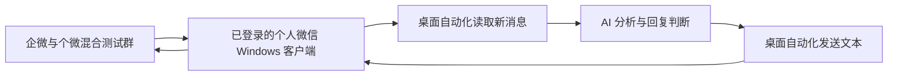

# 中技 AI 群聊机器人：可行性验证

核验日期：2026-09-12。范围按本次对话收敛，仅验证群聊机器人能否跑通。

> 本文保留第一轮判断。参考 Chat-Lab 最新提交的技术复用、离线实验和修订路线，请先阅读 [第二轮评估](./Chat-Lab技术复用评估_第二轮.md)。其中将“同个微数据库读取＋独立桌面发送”列为主候选，实际混合群收发仍待验证。

## 1. 判断

**存在可尝试的实现路径，但目前还不能宣布“你的混合外部群机器人已验证可用”。**

目标是：个人微信账号受邀进入企微与个微混合的外部群，持续接收新消息，交给 AI 分析，并在没有被 @ 的情况下主动回复原群。

优先验证以下最小链路：

当前最大的未知是“接入工具能否在现有微信版本上正确读取并回复这种混合群”。先验证这一点，再接 AI；第一轮无需接入 Chat-Lab，也无需建设完整业务系统。

## 2. 本轮已经核实的事实

| 对象 | 核验结果 | 对机器人验证的影响 |
|---|---|---|
| 引用任务 | 已读取；此前完成仓库克隆和 ZIP 校验 | 此前没有群收发成功的实测记录 |
| Chat-Lab | 本地 HEAD 为 `a42137baaed3e05acbf3863a257f43e1cb68e114`；有采集分析能力，没有消息发送适配器 | 可以后续复用分析能力，不能直接作为完整群机器人 |
| `wechat.zip.temp` | 有效归档；781 个条目，完整流读取通过 | 附件格式正常，但这不代表机器人能力正常 |
| 附件用途 | 包含个人微信和企业微信本地数据库导出工具 | 一次性导出 CSV 无法直接组成实时收发闭环 |
| 附件个微导出器 | `wechat/wx_csv/chat_exporter.py:642–643` 跳过含 `@openim` 的会话 | 如果目标互通会话使用该标识，会被排除；不能把普通微信群导出成功作为混合群验证 |
| 核验机器的微信版本 | 运行中的 Windows 微信，文件与产品版本均为 `4.1.13.65` | 必须匹配这个版本进行验证，不能套用旧版教程的成功结论 |

本轮只做文件、代码、公开文档和程序版本核验，未执行附件程序、查询附件聊天数据库、操作微信界面或向群发送消息。源码细节见 [Chat-Lab 审查记录](./evidence/chatlab-audit.md) 与 [附件审查记录](./evidence/archive-audit.md)。

## 3. 哪条路径值得先试

| 路径 | 本轮判断 | 依据 |
|---|---|---|
| 个人微信桌面自动化 | **首选进行小范围兼容性验证，尚未确认可用** | 能操作已登录个人微信界面的工具有读取、发送方法；目标混合群与本机小版本要单独实测 |
| 企微传统 Webhook 群机器人 | 不满足目标混合外部群 | 腾讯官方文档明确该类机器人不支持外部群，且这里是消息推送入口。[官方说明](https://cloud.tencent.com/document/product/248/50413) |
| 企微智能机器人 | 当前证据不足以替代目标链路 | 新版确有双向及主动推送能力；仍需证明目标外部群权限和非 @ 消息覆盖，不能仅凭“支持群聊”判定满足。[官方 CLI](https://github.com/WecomTeam/wecom-cli) |
| 企业会话存档／本地 CSV 导出 | 可用于消息分析，单独不能完成原群回复 | Chat-Lab 的现有读取路径没有配套外部群发送能力 |
| Wechaty 的 Web 适配器 | 不选作本次混合群验证入口 | 该适配器 README 明确列出不能收发 Work WeChat 消息；这一限制针对该适配器，不代表整个 Wechaty 框架。[项目说明](https://github.com/wechaty/puppet-wechat#known-limitations) |
| WeChatFerry | 不作为当前客户端的首选 | 上游已于 2026-07-10 归档，README 标注的适配版本包含 `3.9.12.51`，不能据此证明支持本机 `4.1.13.65`。[上游仓库](https://github.com/lich0821/WeChatFerry) |

桌面自动化候选可以从 wxauto 系列评估，但目前不能直接指定“安装就能用”：

- 文档有 `GetAllMessage`、`SendMsg` 等接口；前者读取当前窗口中的消息，不能理解为完整历史或永不漏采的事件流。[Chat 类文档](https://docs.wxauto.org/docs/class/Chat.html)
- 当前安装页列明免费版兼容到 `4.1.8.107`，与本机 `4.1.13.65` 不匹配；Plus 的精确兼容性需要进一步验证。[安装与兼容范围](https://docs.wxauto.org/docs/install.html)
- 当前 FAQ 表示不支持企业微信。该声明针对其支持范围，不能证明个人微信内的混合外部群窗口可用；此窗口应作为第一项实验。[项目 FAQ](https://docs.wxauto.org/docs/issues.html)
- 工具作者明确它属于第三方自动化，无法保证持续兼容或免于账号限制。此处只把它作为实验候选。[用户协议](https://docs.wxauto.org/agreement.html)

## 4. 最小实验：先收发，再接 AI

准备一个企微成员创建、包含测试个微账号的混合群；个微账号由本人正常登录 Windows 客户端。只使用测试文本。指定唯一测试群，绑定目标窗口，并在发送前核对目标；群名称本身不能作为可靠的唯一身份。

| 阶段 | 怎么验证 | 通过标准（本项目拟定，尚未执行） |
|---|---|---|
| P0：混合群可读 | 企微成员与个微成员分别发送 10 条带唯一序号的文本，均不 @ 机器人 | 20 条均被读取；能区分所属群和发送者；不把系统提示当作用户消息 |
| P1：原群可写 | 对其中 3 条测试消息各回一条固定文本，例如“BOT-ACK-001” | 企微端与另一个个微端均看到回复；落在原群；每条只出现一次 |
| P2：AI 主动回复 | 在群里连续发两条模拟业务信息，让 AI 合并分析，并根据内容主动回复 | 无需 @；能关联上下文；结果准确；不重复回复自己的输出 |
| P3：持续运行 | 运行 30 分钟，期间切换聊天窗口，并执行一次断网恢复 | 能继续收发；没有串群、自回复循环；重连不自动补发陈旧回复；若出现消息缺口则明确记录 |

**P0 或 P1 不通过，就停止增加 AI 和业务功能，先解决适配器问题。P0–P3 全部通过，才可以将结论改为“该账号、该版本、该混合群的文本机器人 PoC 可行”。** 这次短实验不证明长期无人值守稳定性。

### P2 的具体例子

以下均为合成测试信息，不是实际订单：

1. 企微成员：“测试单 ZJ-DEMO-001，原定今天 16:00 到仓。”
2. 个微成员：“ZJ-DEMO-001 改为 18:00 到仓。”
3. AI 无需被 @，主动回复：“测试单 ZJ-DEMO-001 到仓时间由 16:00 调整为 18:00，延后 2 小时。”
4. 再发一条无关闲聊，AI 保持安静；重复投递上述事件时不再次发送同一结论。

“主动”指由新业务信息触发，不要求每条消息都回复。最小程序只需要：新消息读取、去重、当前群短上下文、模型调用、回复条件、原群发送和停止开关。

## 5. 验证记录

| 项目 | 当前状态 |
|---|---|
| 微信版本 | 已核验：`4.1.13.65` |
| 适配器名称／版本 | 待选择，先核对当前小版本兼容性 |
| 测试群与发送测试消息范围 | 待指定 |
| P0：混合群非 @ 消息读取 | 待实测 |
| P1：原群文本发送 | 待实测 |
| P2：AI 主动分析回复 | 待实测 |
| P3：短时持续运行 | 待实测 |

当前交付结论：**可以开展最小 PoC；现有仓库和附件不能直接证明混合群机器人可用。下一项应完成的验证是本机版本上的混合群文本收发。**

官方接口的补充证据与无法核验的范围见 [官方接口边界记录](./evidence/official-boundary.md)。
